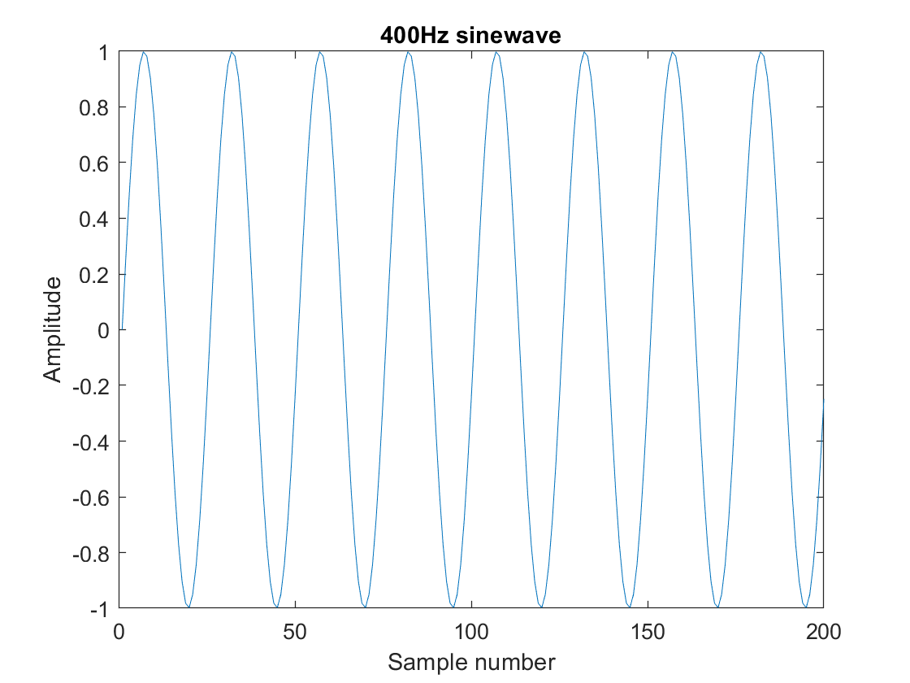
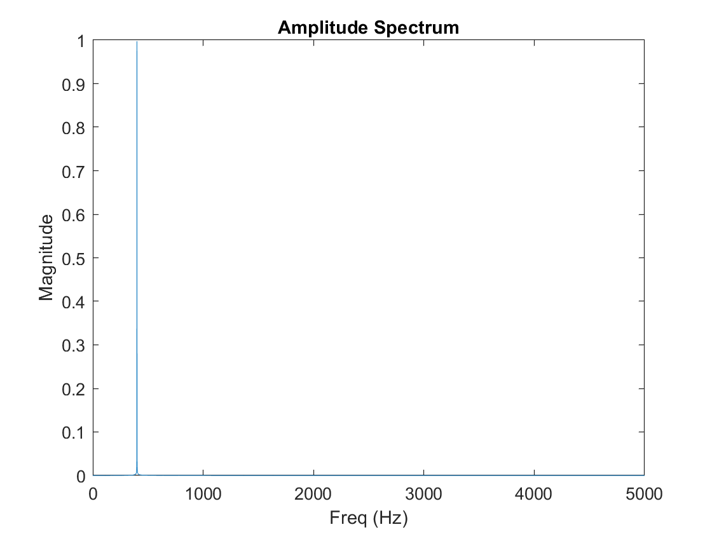
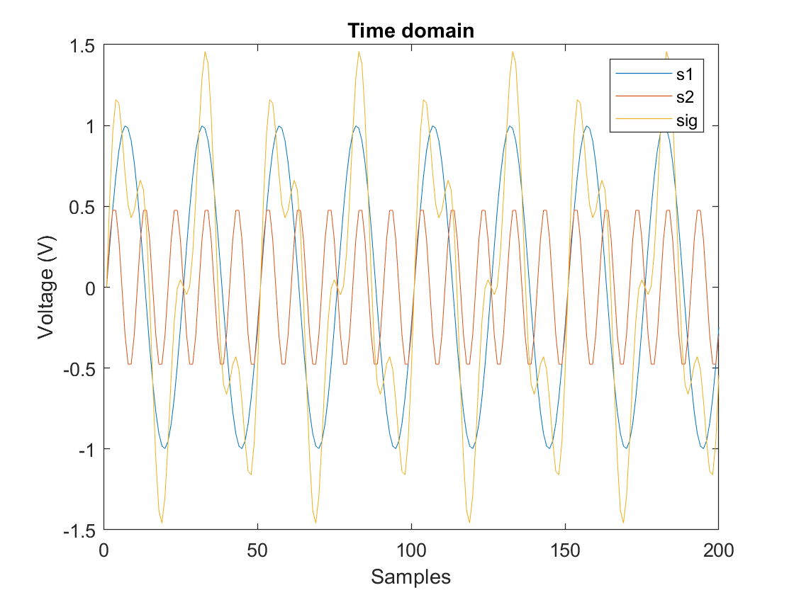
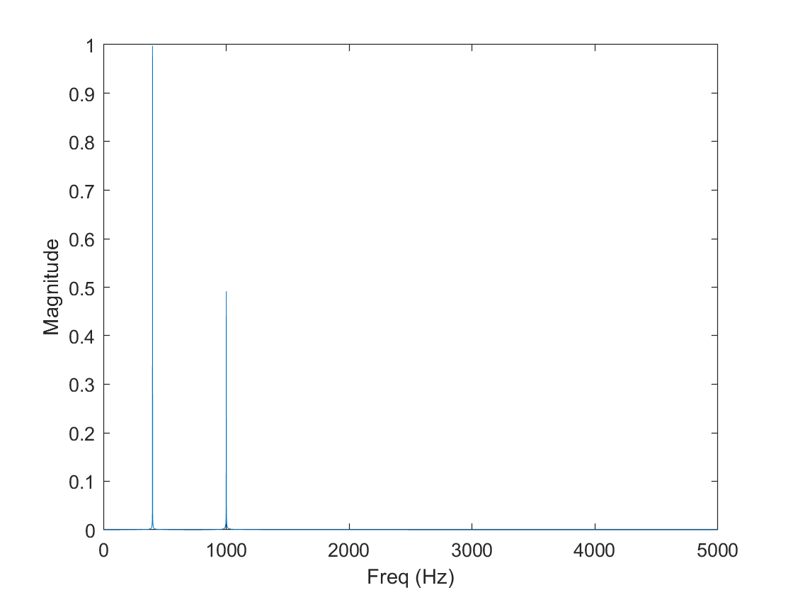
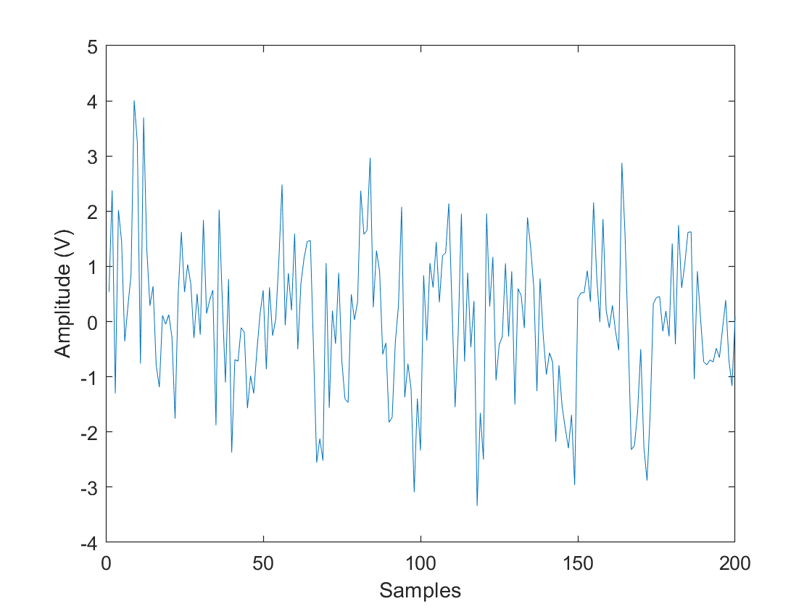
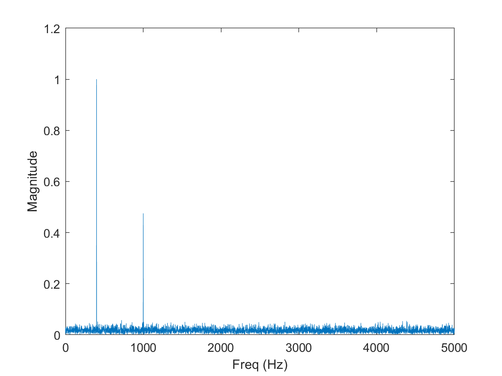
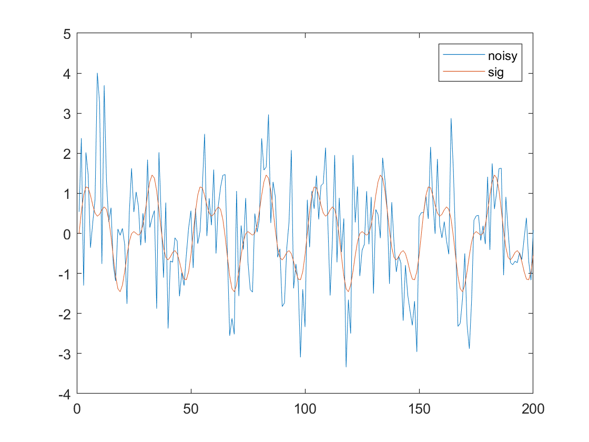
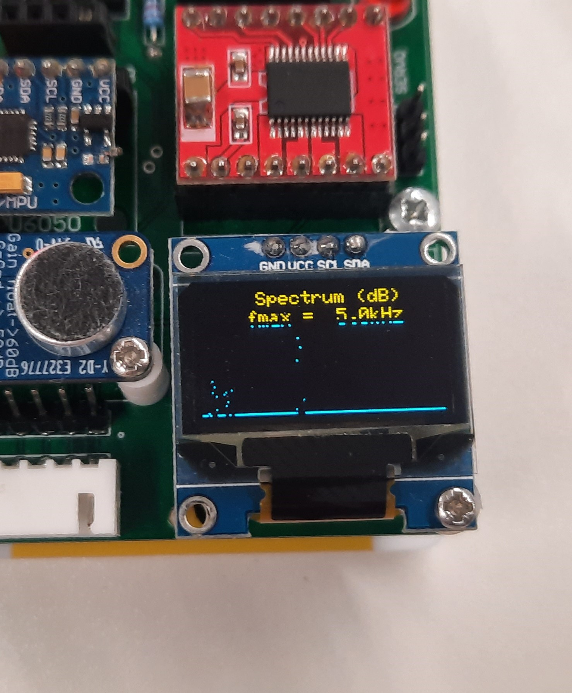
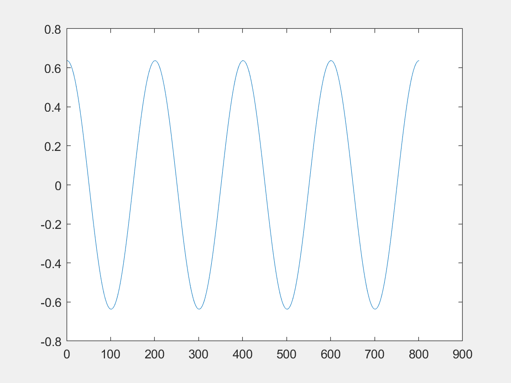

# Electronics 2-Lab 01


This folder contains all the documents regarding the first lab of Electronics 2.

This lab is called Introduction to Signal Processing with Matlab.

## Exercise 1: Sinusoidal signal generation.
The function definition in matlab is function [] outputs equal to name of function(input1,input2,input3) and after a few paragraphs, **end**

```matlab
function [sig] = sine_gen(amp,f, fs, T)

dt = 1/fs; %size of sampling times
t = 0:dt:T; %array of Time from 0 to T in dt steps
sig = amp*sin(2*pi*f*t); %sine function

end
```

The code was tested creating a wave of 400 Hz with amplitude of 1 and a sampling frequency of 10kHz over 1 second. Then the plot function was created and plotted the amplitude from the indexes 1 to 200 even though there is 10000 samples.

<p align="center">

</p>

## Exercise 2: Spectrum of the signal

The function plot spec takes in a signal and a sampling time and produces a frequency amplitude plot
```matlab
function plot_spec(sig,fs)

magnitude = abs(fft(sig)); %magnitude of every sample after fourier transform
N = length(sig); %Number of samples
df = fs/N; %Size of frequency samples
f = 0:df:fs/2;  %Frequency array definition only up to half the sampling frequency because of aliasing? 
Y = magnitude(1:length(f)); %Selection of FT values equal size as frequency array
plot(f,2*Y/N); %plot times mag*2 and divide by number of samples?
xlabel("Freq (Hz)");
ylabel("Magnitude");
end
```

There is a reason which I dont remember for the x domain to be half the sampling frequency I believe it has to do with aliasing but I am not sure. In order to normalise the amplitude values they are divided by N which leaves each of the frequency peaks at a height of 0.5 like in the regular fourier transform of a cosine but it is divided by 2 again for normalising.

<p align="center">

</p>

## Exercise 3: Two tones
 
 I created two signals as such:

 ```matlab
 s1 = sine_gen(1,400,10000,1);
 s2 = sine_gen(0.5,1000,10000,1);
 sig = s1 + s2;
 ```

 Which I then visualised 200 samples in the time domain:

<p align="center">
 
</p>

 And the frequency amplitude plot shows the normalised weights of each frequency component in the sig signal. 2:1 ratio.

<p align="center">
  
</p>

 ## Exercise 4: Two tones + noise

 In order to create a noisy signal I did:
 ```matlab
 noisy = sig + randn(size(sig));
 ```
 which visualises 200 samples on the time domain using

 ```matlab
 plot(noisy(1:200));
 ```
<p align="center">
  
</p>

Then I plotted the frequency spectrum
```matlab
plot_sec(noisy,10000);
```
<p align="center">
  
</p>
 What I have learnt is that even though the time domain signal looks very different in comparison (noisy and no noise)

<p align="center">
  
</p>

  The fourier transform is still able to identify the importance of the main frequency components. Which means that is easier to analyse noisy signals in the frequency domain as well.

  ## Exercise 5: Projection using dot product
Checking the orthogonality of different sine functions.

  ```matlab
  dot_product = dot(s1,s2);
  ``` 
The result of the dot product is **1.72e-13** which is matlab's way of saying 0.

I created a new sine wave s3 of frequency 401 Hz
```matlab
s3 = sine_gen(1,401,10000,1);
```
And checked the dot product again between s1 and s3 which in this case was **-1.969e-10** which computationally is that but mathematically should be 0.

However, when we check the projection of s1 in sig which is (s1 and s2) we find **5000** which is a non zero value showing there is a component of the function made of **s1**

## Exercise 6: Using PyBench board as a spectrum analyser

We used a 2kHz sine wave and yes it worked. Very impressive that it did it on real time.

<p align="center">

</p>
You can see the peak in the middle which represents the 2kHz signal.


## Extra challenges

For the first challenge I modifies the sine_gen script and added another input which represents the phase.

```matlab
function [sig] = sine_gen2(amp,f, fs, T,phase)

dt = 1/fs; %size of sampling times
t = 0:dt:T; %array of Time from 0 to T in dt steps
sig = amp*sin(2*pi*f*t + phase); %sine function

end
```

I made this script where I varied the phase of the orange (s2) wave while keeping s1 constant and plotted the animated result :) I used the Animation.m file it requires signal_gen2.m to do it. (Animation.m)

<p align="center">

</p>

Then for the fourier one we just made a script that changed An over a range of values with different values of n and sum those weighted cosines together to obtain the aproximation of the square wave. (Animation2.m)

<p align="center">

</p>