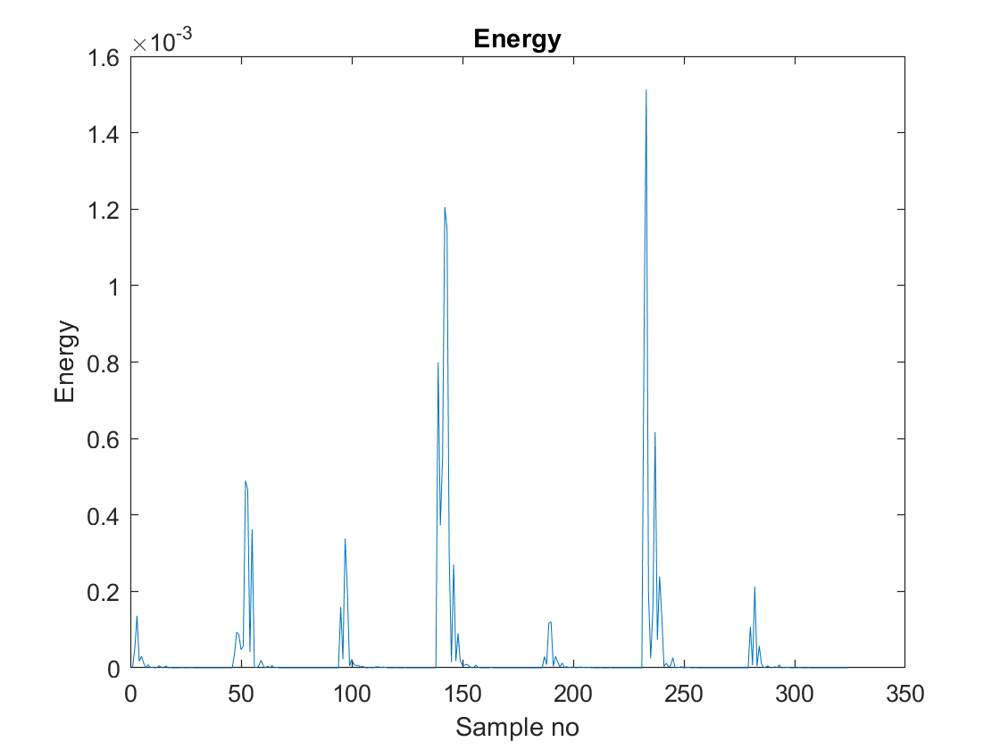
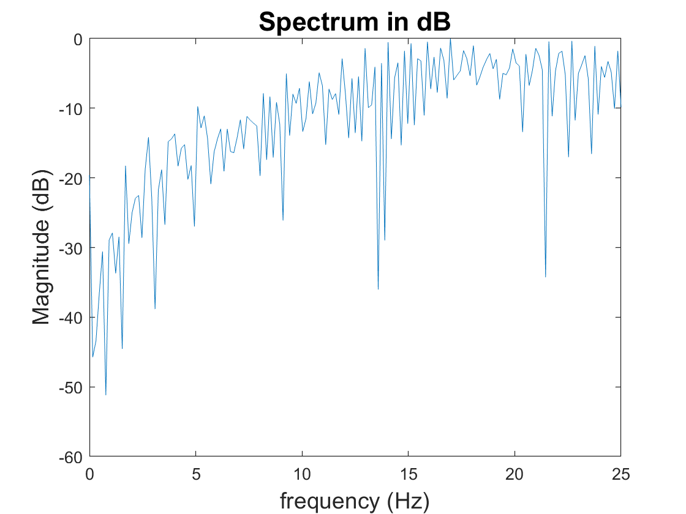

# Electronics 2-Lab 02


This folder contains all the documents regarding the second lab of Electronics 2.

This lab is called Signal Processing with PyBench & Matlab.

## Task 1: Connecting the PyBench h board to your PC or Macbook running Matlab.

### Step 1
We had issues, it was the cable the problem. It worked with both of them.


### Step 2 Testing the PyBench system is working properly

All tests worked and passed without a problem.

### Step 3 :  Check that Matlab on your computer is talking to PyBench hardware

Matlab detects the serial port "/dev/tty.usbmodem..."

We set the folder with the pyBench functions as a path on matlab and tested it using:

```matlab
ports = serialportlist;
pb = PyBench(ports(end))
```

## Task 2: Using PyBench to generate signals via Matlab and explore their spectra


We had to do this task last, because of we did not have a oscilloscope. But we created the script lab2task2.m with the following code:


```matlab
clear all
ports = serialportlist;
pb = PyBench("COM7");
f = 440;
fs = 8000;
pb = pb.set_sig_freq(f);
pb =pb.set_samp_freq(fs);
pb =pb.set_max_v(3.0);
pb =pb.set_min_v(0.5);
pb =pb.set_duty_cycle(50);
pb.triangle();
```
And we tried changing different parameters to look at the output of the PyBench:

Sine wave

<p align="center">

</p>


Triangle wave

<p align="center">

</p>


Square wave

<p align="center">

</p>

The voltages are negative for some reason (We wired it the same the diagram indicated) but match very closely what he had programmed on matlab.

We then captured the waves generated and fourier analysed them to obtain the frequency components of the signals using plot spec from the previous lab. Modifying the script by adding this:

```matlab
N = 1000;
samples = pb.get_block(N);
data = samples - mean(samples);
figure(1);
plot(data(1:200),'o');
hold on
plot(data(1:200));
hold off
figure(2);
plot_spec(data,fs);
```

Sine wave:

<p align="center">

</p>

As you would expect there is only one component because of the orthogonality of sine waves. It is a pure sine wave which is only made up of one frequency sine wave. But not only that but it has been critically sampled. The freq of the wave is 440Hz which do 55 oscillations during the 1000 samples of the 8000Hz sampling frequency. In theory all of these have been critically sampled because they all share the 440Hz frequency

Triangle wave:

<p align="center">

</p>

The triangular wave can be explained by the fourier transform of a triangular signal and it matches the shape, which the harmonics at 3f and 5f.

<p align="center">

</p>

Square wave:

<p align="center">

</p>

The square wave is a bit weirder, it does follow the shape sort of sinc function and matches the examples with strong harmonics at 3f ,5f, 7f and 9f and no even harmonics due to the odd nature of the square function. However there seems to be extra leakage which could be explained with imperfect windowing but it is weird because there was no leakege or imperfect windowing on the ones above. I have two theories one could be that due to the sudden changes of the square wave it is more sensitive and it is harder to critically sample a square wave or due to the pyBench which of course all square waves are approximations in reality and are never perfect hence the different frequency components.

## Task 3: – Capture and analyse microphone signals

We ran the code and played with a tune fork at 2kHz using this code which relays on plot_spec from the previous lab.

```matlab
clear all
%setting up pyBench
ports = serialportlist;
pb = PyBench(ports(end));
%set fs
fs = 8000;
pb = pb.set_samp_freq(fs);
% Capture a number of samples
N = 1000;
samples = pb.get_mic(N);
%This step removes DC offset
data = samples - mean(samples);
%plot data
figure(1);
clf
plot(data);
xlabel("Sample Number");
ylabel("Signal Voltage (V)");
title("Microphone signal");

% fing and plot spectrum
figure(2);
plot_spec(data,fs);

```

These are the plots we got from non-continious running:


<p align="center">

</p>
<p align="center">

</p>

Then we modified the code to make the sampling continious **clf clears current figure**.

We plotted from 3kHz to 5kHz in intervals of 500Hz and found the following:

<p align="center">

</p>

This is due to breaking the sampling theorem, our fs is 8kHz and the program behaves as expected exactly until fs/2 (4kHz) then it bounces back down in the same intervals. This is the spectral folding effect of aliasing.

$$ |f_a| = |f \pm mf_s|$$
 where m is an integer and where 
 $$ |f_a| \le \frac{f_s}{2}$$

 When you input f of 4.5kHz only m = 1 can satisfy then fa less than fs/2 and it results on 3.5kHz, it also happens with 5kHz and results on fa being 3kHz.

 Then we modified the number of samples which up and down, going up provides more resolution and can see all the different frequency components of our voices we could only go up to 10k I think, increamenting the number of samples, increments the time to compute but in reality it has an effect on the time period measured over

 $$N_0 = f_sT$$

When it goes down a lot of resolution is lost and you can barely see anything.

<p align="center">

</p>


## Task 4 – Windowing effect on a signal

We made sure to understand the plot db code
```matlab
    magnitude = abs(fft(sig));
    N = length(sig);
    df = fs/N; 
    f = 0:df:fs/2;
    m_max = max(magnitude);
    Y = 20*log10(magnitude(1:length(f))/m_max);
    plot(f, Y)
       axis([0 fs/2 -60 0]);
    xlabel('\fontsize{14}frequency (Hz)')
    ylabel('\fontsize{14}Magnitude (dB)');
    title('\fontsize{16}Spectrum in dB');
```
It works out the magnitude and the largest magnitude to normalise the data and then turn it into dB. dB are all ratios between frequencies and the largest value.

These are the dB plots of 1 and 1.1kHz. There seem to be other frequency components which probably are due to the inacurracy of the tone generator.

1kHz
<p align="center">

</p>
1.1kHz
<p align="center">

</p>

We had to add the following code to lab2task4.m which would window the data using **hamming()** from the signal processing toolbox.

```matlab
figure(2);
plot_spec_dB(data,fs);
window = hamming(length(data));
while true
  samples = pb.get_mic(N);
  data = samples - mean(samples);
  clf;
  plot_spec_dB(data,fs);
  hold on
  plot_spec_dB(data.*window,fs);
end
```
1kHz
<p align="center">

</p>
1.1kHz
<p align="center">

</p>


## Task 5 – Music signal segmentation and analysis

Created the 5th lab file using the following code 

```matlab
clear all
[sig fs] = audioread("two_drums.wav");
sound(sig,fs)
%plotting
figure(1)
clf;
plot(sig);
xlabel("Sample no");
ylabel("Signal (V)");
title("Two drums");
```

First we had to make our own resampler which was pretty fun. Essentially we had to work out how many samples where in a 20ms interval which was 882, so each new sample must contain 882 previous samples and there should be in theory according to the length of the signal 323.238 samples, however it could not be a decimal number so we had to round it up, I added one and round to 324. I worked out the size of the matrix in theory if it had all the samples and by substracting it from the original size I worked out the number of required "0" samples to add at the end to make up for the size difference. I concatenated them and had to be careful with the reshape function and invert my rows and cols to then transpose it due to the nature of how the function works. This was my resulting code:

```matlab
clear all
[sig fs] = audioread("two_drums.wav");
T0 = 1/fs;
dt = 20e-3;
N_ineach = dt/T0;
rows = round(length(sig)/N_ineach +1);
obj_size = rows*N_ineach;
size_diff = obj_size-length(sig);
M  = zeros(1,size_diff);
cato = cat(2,sig',M);
cato = reshape(cato,[N_ineach,rows]);
figure(1)
clf;
plot(mean(cato',2));
xlabel("Sample no");
ylabel("Signal (V)");
title("Two drums");
```
Okay I did not realise we were given the code so I made it :(. It works and here is the result of the resampled signal from 44100Hz to 50 Hz.

<p align="center">

</p>

Oh well

Here are the plot of the energy I got from my own code I got by element wise squaring of the my resampled signal.

<p align="center">

</p>

The peaks closely follow the amplitude of the time domain signal.

<p align="center">

</p>


However, after revisiting this section I realised I had committed some errors in my code: the first error was meaning the value of each sample instead of computing the sum of each row. The second error arrives when computing the energy and it is because I misunderstood the formula, essentially once I had done the sum to work out the new sample value I would square it to obtain the energy. What the formula was saying was to square each value first and then add them together so the other way around within each new sample. I fixed the code:

```matlab
T0 = 1/fs;
dt = 20e-3;
N_ineach = dt/T0;
rows = round(length(sig)/N_ineach +1);
obj_size = rows*N_ineach;
size_diff = obj_size-length(sig);
M  = zeros(1,size_diff);
cato = cat(2,sig',M);
cato = reshape(cato,[N_ineach,rows]);
resampled = sum(cato',2)/max(abs(sum(cato',2)))
E = sum(cato'.^2,2);
```

Then these are the same plots that the example does (I don'get plotting the spectrum of the energy like what do you obtain after computing the fourier transform of energy?, so I have plotted the spectrum of the original signal on the time domain)

Signal Time domain

<p align="center">

</p>

Energy peaks

<p align="center">

</p>

Energy spectrum Freq(I dont get)

<p align="center">

</p>

Freq spectrum db
<p align="center">

</p>

Task number six I would love to it but for now I have had enough of this lab hehe, to combine signals you just have to equal the sizes of the matrices by adding more ceros to the smallest one.
