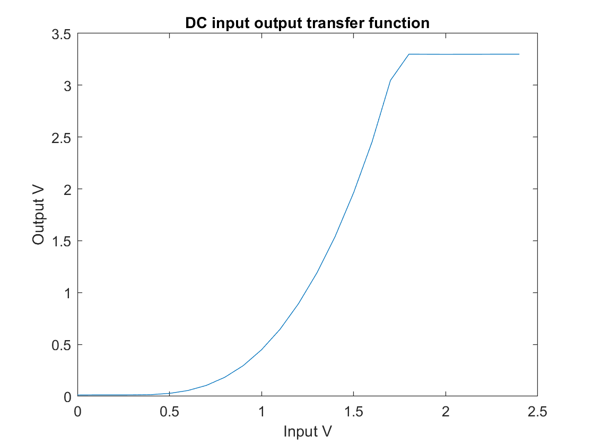
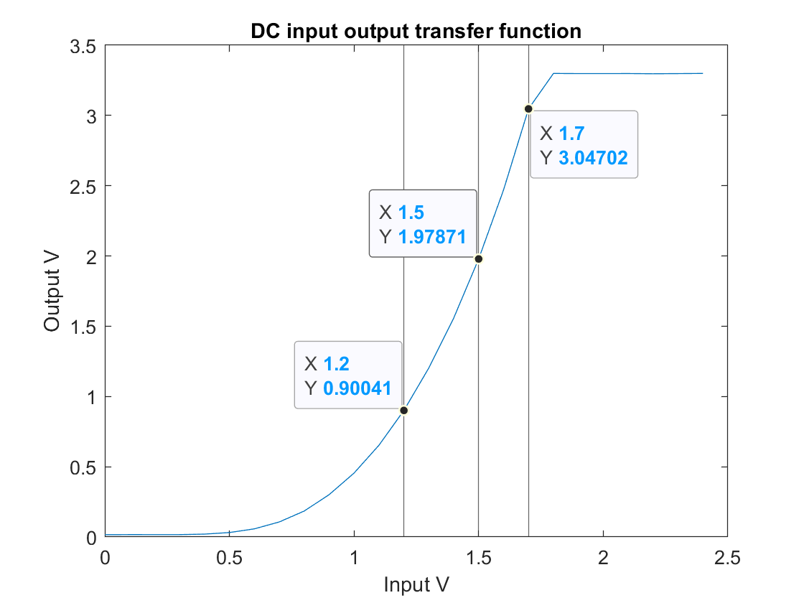
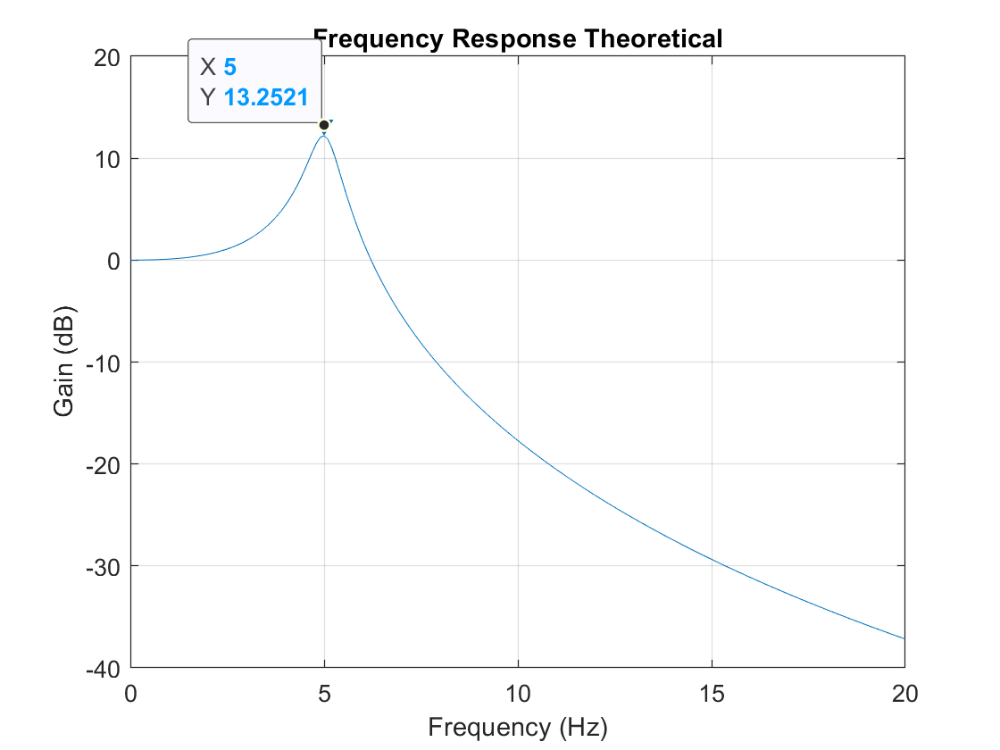
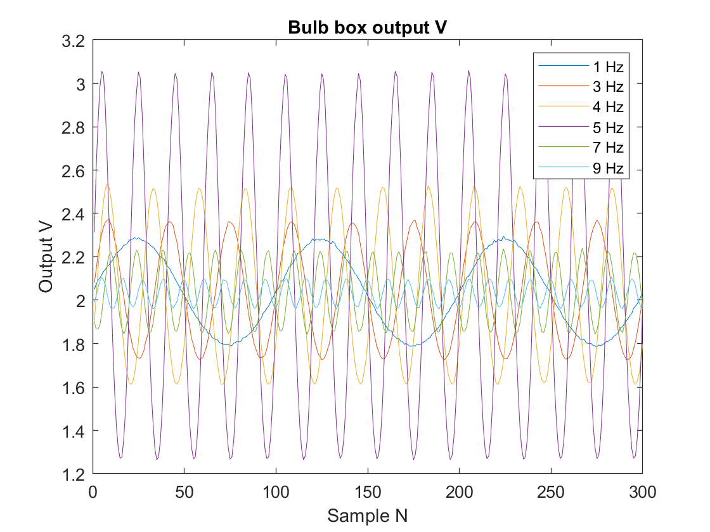
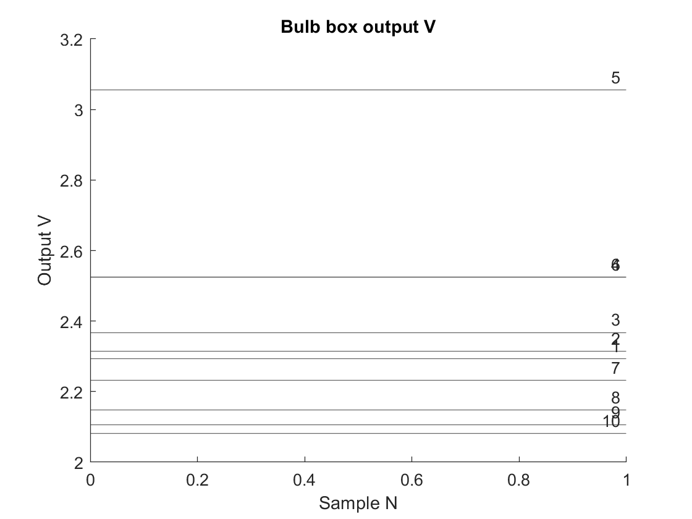
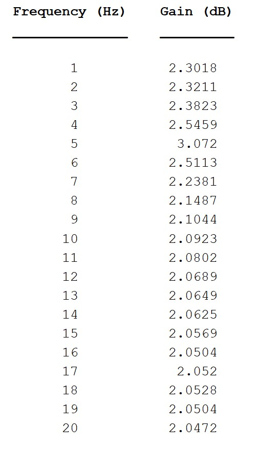
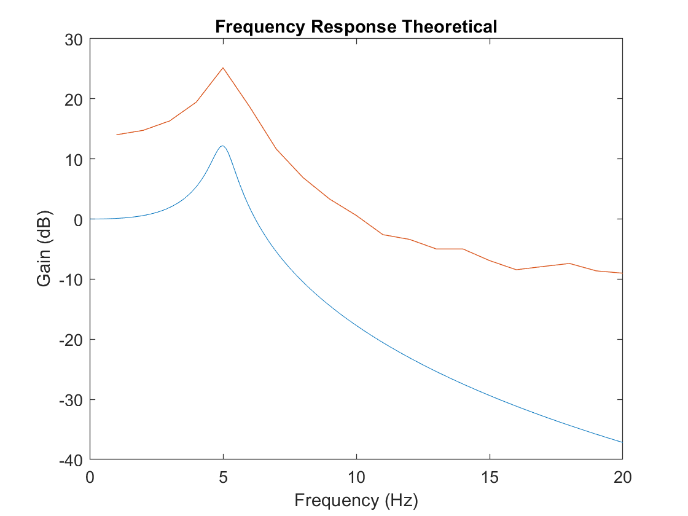
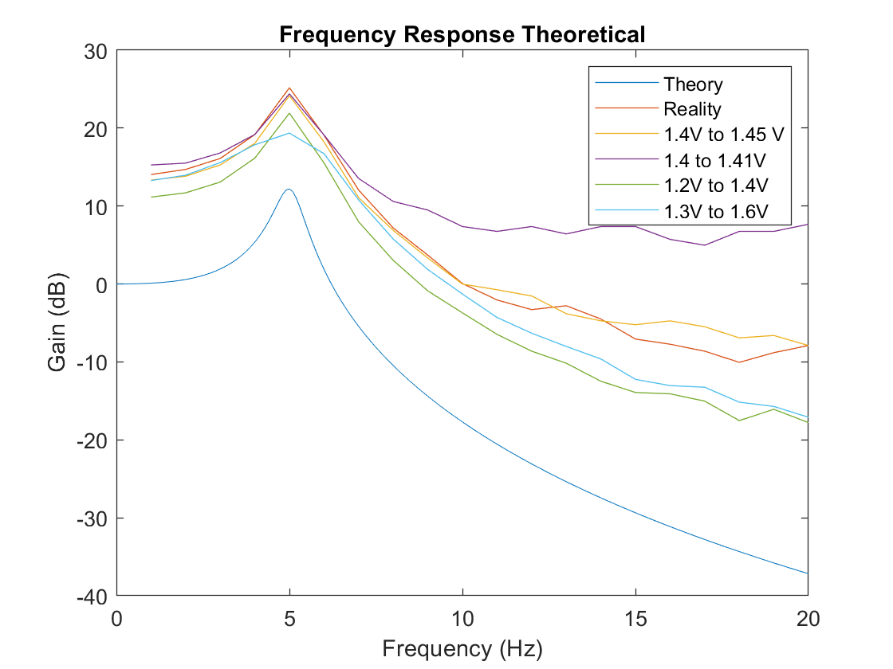
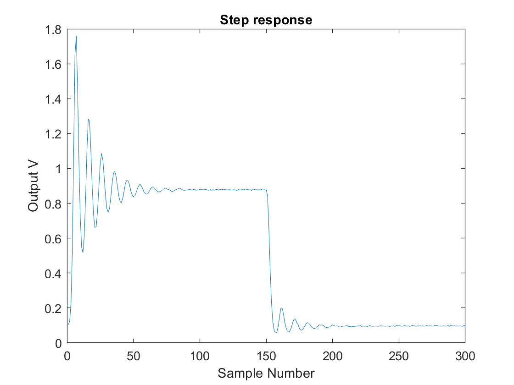
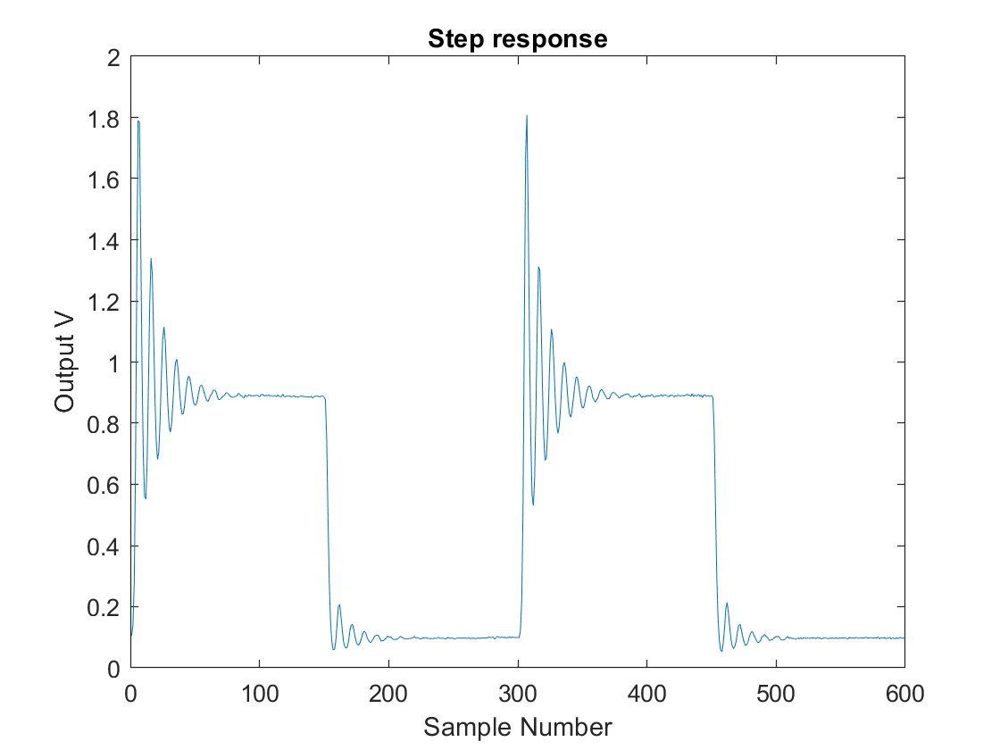

# Electronics 2-Lab 03


This folder contains all the documents regarding the third lab of Electronics 2.

This lab is called System Characterisation & Transfer Function.

## Check that Bulb Board works
The board is working fine and the potentiometer tuned to output ~2 V.

<p align="center">

</p>

## Task 1: DC Characteristic of the Bulb Board
On this step we want to understand the response of the system by simply using DC voltage or zero frequency voltage. We entered the following code on the command line, I had to identify the COM port myself, the code provided is not always true.

```matlab
pb = PyBench("COM7")
pb.dc(1.5);
pause(1);
pb.get_one()
```
This code inputs 1.5 across the bulb, pauses to reach steady state and then reads the voltage across the photo transistor. I got **1.957 V** but sometimes I got like 20 V or some other weird values probably non steady state values.

The same thing happened when I input the 0 V, at first I was getting like 27 V and 1. something and eventually got around **0.0137 V**

In order to determine the max and min values of the output voltages given by the input voltages (bounds, it is a bounded system?) we are performing a sweep of different input Vs with the following matlab code:

```matlab
ports = serialportlist;
pb = PyBench("COM7");

pb.samp_freq = 100;
NSTEPS = 25;
input = zeros(NSTEPS,1);
output = zeros(NSTEPS,1);
tic
disp("Sweeping drive voltage for DC steady state characteristics");
for i = [1:NSTEPS]
    v = (i-1)*2.5/NSTEPS;
    input(i) = v;
    pb.dc(v)
    pause(0.5);
    data = pb.get_block(10);
    output(i) = mean(data);
end
pb.dc(0.0);
toc
figure
plot(input,output)
xlabel("Input V");
ylabel("Output V");
title("DC input output transfer function");
fclose(instrfind());
```

And this was the output graph:

<p align="center">

</p>

Although the shape of the curve already shows non linear behavior, to prove the linearity of a system we can look if the properties of additivity, homogeneity or superposition are exhibited:

Superposition which is a combination of the two is given by:

A system $$ S : X \to Y$$ where X and Y are sets of real number (but could be sets of signals).

$$ \forall\  x_1, x_2 \in X\  \text{and} \ \forall \ a, b \ \in \rm I\!R  \ \ S(ax_1 + bx_2) = aS(x_1) + bS(x_2)$$

If I pick to input values like 1 and 1.5 (x1 and x2) and two scaling factors like 1 and 0.5 (a and b) and input them into the equation we find the left hand side to be:

$$S(1 \ + \ 0.75) = S(1.75)$$
which by looking at the graph is around **3.1 V** (of course there is going to be some error from reading from the graph but the difference will be significant enough) The right hand side as:

$$S(1) + \frac{1}{2}S(1.5) $$

When x is 1 the value in the graph is of **0.448 V** and when x is 1.5 the output is **1.96 V**, then applying the scaling factors a and b and summing them together yields **1.428 V** no where near from 3.1 therefore the system is not linear, I know this proof is meant to be done with equations rathe than reading off the graph but I wanted to apply the theory I have learnt.

If the system was linear it would follow a straight line relationship.Such as for example  $$S(x) = 2x $$

The most linear regions are these two but separately from each other (1.2 to 1.5 and 1.5 to 1.7)

<p align="center">

</p>

Beyond 1.8 V the function becomes invariant but not linear it would not satisfy the superposition property but it is still intersting.


## Task 2: Frequency Response of the Bulb Board system – Theoretical only

The purpose of this task is to use the trasnfer function equations of the bulb board system to predict the frequency response H(jw) of the bulb board using matlab

The system can be modelled as a linear system as two things in series first the second order circuit and the first order

second order transfer function:
$$ H(s) = \frac{1000}{s^2 + 5s +1000}$$

First order transfer function

$$ B(s) = \frac{1}{0.038s +1}$$

The Laplace model of the two can be derived from the product of these two
$$G(s) = H(s)B(s)$$
$$ G(s) = \frac{1000}{0.038s^3 + 1.19s^2+ 43s + 1000}$$

We want to find the gain of the system for sinusoidal signals x(t) at different signal frequencies, aka the frequency response

This can be easily displayed on matlab using the following code:

```matlab
f = (0:0.1:20);
D = [0.038 1.19 43 1000];
s = 1i*2*pi*f;
G = 1000./abs(polyval(D,s));
Gdb = 20*log10(G);
figure;
plot(f,Gdb);
xlabel("Frequency (Hz)");
ylabel("Gain (dB)");
title("Frequency Response Theoretical");
```

And this was the result:
<p align="center">

</p>

The frequency response indicates that for this given system the largest gain in dB will be when frequency is five hertz with a **positive gain of 13.3dB!** and for higher frequencies it reduces the gain it is behaving like a low pass filter with a cut off frequency of five hertz.

## Task 3: Measure the Frequency Response of the Bulb Board system using PyBench

The purpose is to measure the real frequency response of the bulb board using small amplitude sinewaves at different frequency

We will be looking at the linear region of the system from 1.45 to 1.55V which is a fairly linear region so it could be a decent approximation of a linearity.

The following code evaluates the gain of the output signal at a given frequency:


```matlab
clear all
ports = serialportlist;
pb = PyBench("COM7");
max_x = 1.55;
min_x = 1.45;
f_sig = 5.0;
pb = pb.set_sig_freq(f_sig);
pb = pb.set_max_v(max_v);
pb = pb.set_min_v(min_v);
pb.sine();
pause(2)
pb = pb.set_samp_freq(100);
N = 300;
y = pb.get_block(N);
plot(y);
xlabel("Sample N");
ylabel("Output V");
title("Bulb box output V");
x_pk2pk = max_x - min_x;
y_pk2pk = max_y - min_y;
G = y_pk2pk/x_pk2pk
G_dB = 20*log10(y_pk2pk/x_pk2pk)
```

And here I have adjusted manually the frequency of the code at 1, 3, 4, 5, 7 and 9. Overlapped the output graphs and made a table with their gain values.

<p align="center">

</p>

This one shows the maximum values from 1 to 10Hz which is a bit more illustrative than all the overlapped sines.

<p align="center">

</p>

I kind of when ahead of the lab and generated the code for the automatic steps, here is the table of frequency values and their respective gains from 1 to 20Hz (The tittle of the right column is wrong should be Voltage instead of Gain)

<p align="center">

</p>

I worked out the gain for each frequency in db and plotted on the same plot as the theoretical frequency response

<p align="center">

</p>

The shape is closely followed by the practical filter which is a great success however there seems to be some sort of offset but DC offets should not matter as the gain is a ratio and also it is worked out by using peak to peak voltages, perhaps it has to do with the non linearity of it. I will try with a smaller amplitude V to see it's effect. 
The yellow line shows a frequency response from 1.4V to 1.45 V and the purple one from 1.4 to 1.41V and so far they have followed my predictions kind of? The green one goes from 1.2V to 1.4V surprisingly it went against what I thought, this has lost me a bit not going to lie. My last attempt to get close will be with the largest region I consider to be the most linear from 1.3V to 1.6V (light blue) and I predict it will be the best approximation to the theoretical response.

<p align="center">

</p>

And my prediction was completely wrong, in fact the last one was probably the worst approximation as it broadened the peak where as the best one was 1.2 to 1.4V. Very interesting but I am not sure why this happens perhaps it is just the physical nature of the system.
## Task 4: Measure the Step Response of the Bulb Board

In this task we want to look at the transient response of the system instead of steady state response

Using the following matlab script:


```matlab
clear all
clf
ports = serialportlist;
pb = PyBench("COM7");
fs = 50; 
pb = pb.set_samp_freq(fs);
x_min = 0.7;
x_max = 1.2;
N = 150;

pb.dc(x_min);
pause(1);
pb.dc(x_max);
rise = pb.get_block(N);
pb.dc(x_min);
fall = pb.get_block(N);
data = [rise' fall'];

figure(1)
clf
plot(data)
xlabel("Sample Number");
ylabel("Output V");
title("Step response");
fclose(instrfind());
```

And this is the output:

<p align="center">

</p>

The transient (voltage) response is oscillatory and different from rise to fall or so I think for this reason I modified the code and repeated it again.
 
 <p align="center">

</p>

And indeed, the nature of the transient action is different for rising than it is for falling, mostly in magnitude but also in time taken to settle. The time taken to settle from a rise is of aprox 90 samples with a fs of 50 Hertz is about 1.8 seconds and for rising aprox 75 samples which is about 1.5 seconds.

 <p align="center">

</p>

This was the best lab so far, I wish we got to do more of the matlab code but it was very informative and the purpose of each task is very good to have.