# Electronics 2-Lab 04


This folder contains all the documents regarding the fourth lab of Electronics 2.

This lab is called IMU and OLED Display

## Task 1 : The Inertia Measurement Unit (IMU)
we are gonna be using the accelerometer and the gyroscope using the following functions we can access each

```matlab
[p, r] = pb.get_accel();
[x, y, z] = pb.get_gyro();
```
Where p is the pitch and r is the roll angle in radians and x y and z are the rate of rotations in the 3 axes in **radians not degrees**.


### Testing Accelerometer

We used this code to test the accelerometer
```matlab
clear all
close("all")
pb = PyBench("COM7");
N = 500;
end_time = 10.0;
while true
    figure(1)
    clf(1)
    axis([0 end_time -90 90]);
    title("Acc P and R");
    ylabel("Angles(deg)");
    xlabel("Time (sec)")
    grid on; hold on;
    tic;
    for i = 1:N
        [p,r] = pb.get_accel();
        timestamp = toc;
        pitch = p*180/pi;
        roll = r*180/pi;
        plot(timestamp,pitch,'.b');
        plot(timestamp,roll,'.r');
        pause(0.001);
    end
end_time = toc;
end

```
It is pretty self explanatory note the use of tic and toc which I did not know to use as timers, very interesting function.

I am writting this after doing task 2, the noise of the accelerometer is noticiable after comparing it to the gyroscope readings. Without any reference it was hard to determine if it was noise or just very sensitive.

These are the orientations of the pitch and roll which match the diagram on the board.

<p align="center">
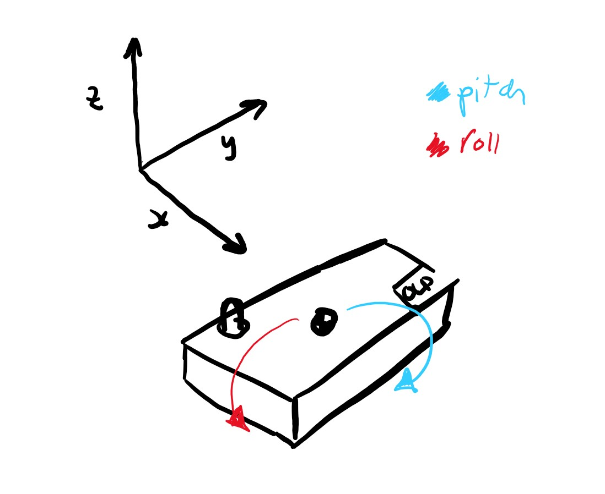
</p>


This is a plot of sort of random motion getting the pitch and the roll in antiphase.
<p align="center">
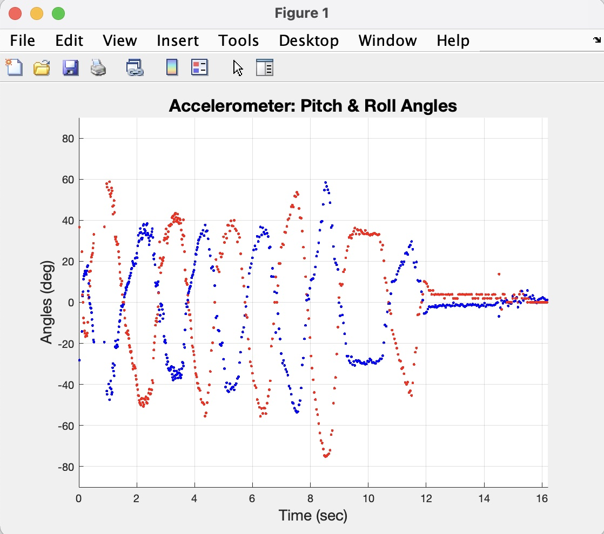
</p>


Sliding motion at introduces noise to the pitch and roll angles, the board has not rotated but because the accelerometer measures the forces in x and y it can be fooled to think it is rotating when it is simply being moved around.

<p align="center">
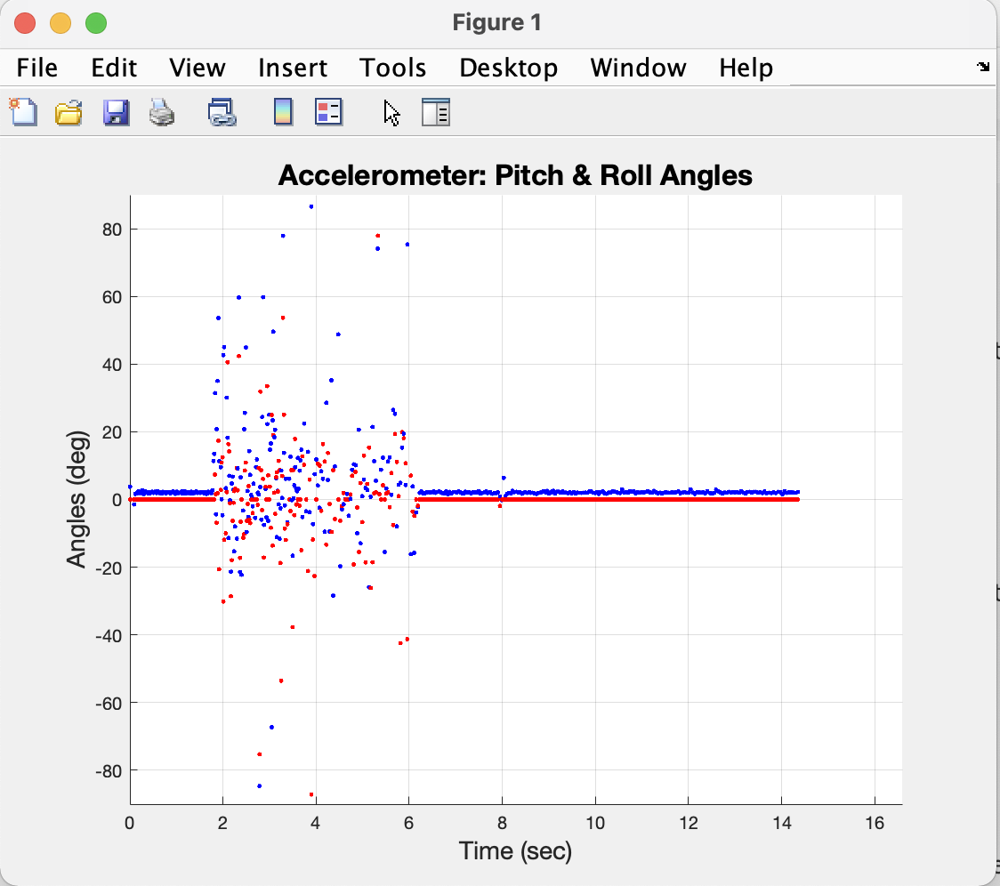
</p>


### Testing the gyroscope

We used this code to test the gyroscope:

```matlab
clear all
close("all")
pb = PyBench("COM7");
N = 500;
end_time = 10.0;
gx = 0; gy= 0; gz =0;
while true
    figure(1)
    clf(1)
    axis([0 end_time -90 90]);
    title("Gyro P and R");
    ylabel("Angles(deg)");
    xlabel("Time (sec)")
    grid on; hold on;
    timestamp = 0;
    tic;
    for i = 1:N
        [x,y,z] = pb.get_gyro();
        dt = toc;
        timestamp = timestamp + dt;
        gx = max(min(gx +x*dt,pi/2),-pi/2);
        gy = max(min(gy +y*dt,pi/2),-pi/2);
        gz = max(min(gz +z*dt,pi/2),-pi/2);
        plot(timestamp,gy*180/pi,'.b');
        plot(timestamp,gx*180/pi,'.r');
        plot(timestamp,gz*180/pi,'.g');
        pause(0.001);
    end
end_time = timestamp;
end
```

The integration through sumation is a bit unclear, min limits the values to pi/2 and max makes sure they do not go under -pi/2 it is the recurrence relationship which causes integration through sumation. So it works out the angle and add it to the previous one which could be thought as segments adding to other segments. It would make sense that errors accumulate. I also dont get why dt is defined like that, it is constaly increasing with toc it is not a fixed size maybe it has to do with the integration thing.

I took the chance to look at jaw (green):

<p align="center">
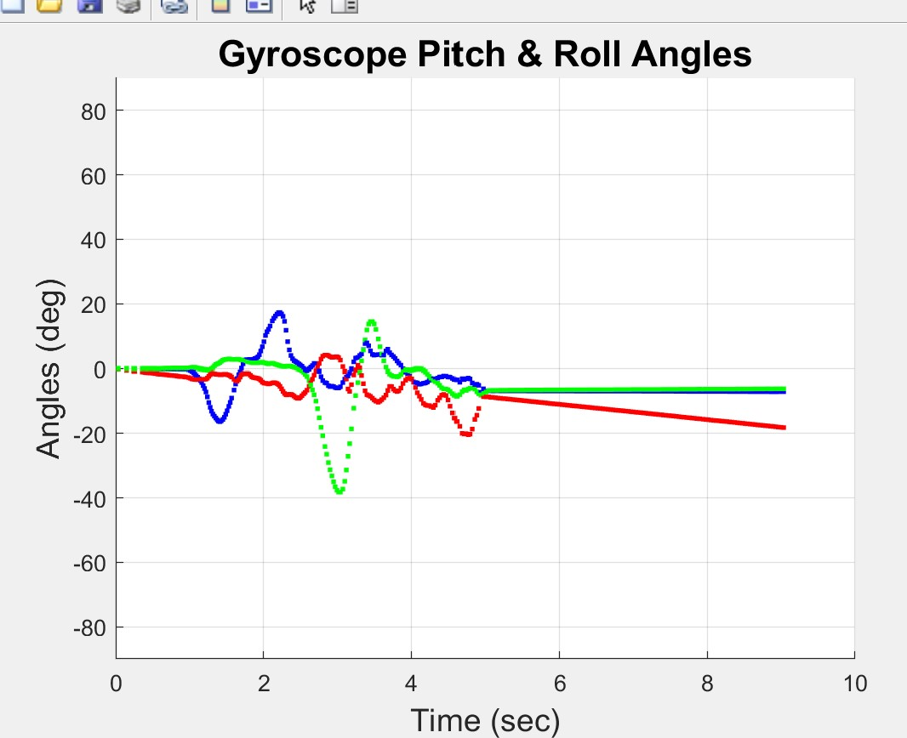
</p>

There seems to be an error in our roll reading from the gyroscope, it is linear and no matter what angle it is stopped at it decreases linearly.

By reading the graph it can be determined it is decreasing at a rate of, it decreases 20 degrees every 8 seconds so we need to add 20*(pi/180)/8*dt but then it goes up instead. It is not clear why there is only an offset for the x axis and not the y axis angle.

I tried compensating for it by adding the error back but because it wasnt perfect it started going up!


## Task 2 Visualization in 3D

<p align="center">
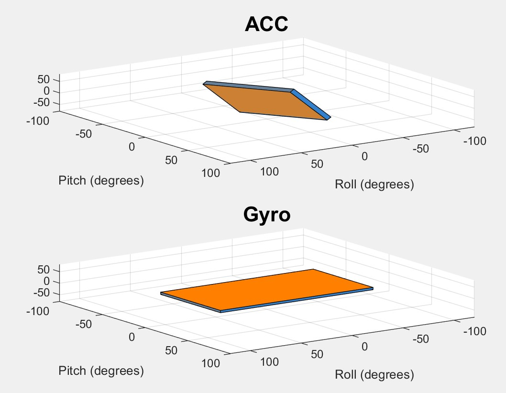
</p>

We had to install the aero tool box to enable the draw object methods.

The gyro model has the drifing problem and the accelerometer is very responsive and sort of vibrates due to the noise where as the the gyro moves smoothly until it reaches negative 90 degrees. Pretty nice visualisation but the crazy drifting gyro just ruins it really.

This was the code used:

```matlab
clear all
close("all")
pb = PyBench("COM7");
model = IMU_3D();
N = 50;
tic;
gx = 0; gy=0;
fig1 = figure(1);
while true
    for i = 1:N
        [p,r] = pb.get_accel();
        [x,y,z] = pb.get_gyro();
        dt = toc;
        tic;
        pitch = p*180/pi;
        roll = r*180/pi;
        gx = max(min(gx +x*dt,pi/2),-pi/2);
        gy = max(min(gy +y*dt,pi/2),-pi/2);
        clf(fig1);
        subplot(2,1,1);
        model.draw(fig1,p,r,"ACC");
        subplot(2,1,2);
        model.draw(fig1,gy,gx,"Gyro");
        pause(0.0001);
    end
end

```


## Task 3 Combining the two measurements using Complementary Filter


In order to reduce noisiness and the drifting effect both measurements can be combined using a complementary filter arrangement to obtain a more accurrate description of the angular measurement of the board. I am fascinated by this but I do not understand it at all. 

Like it makes sense that for the accelerometer you pass it through a low pass to eliminate high freq (noise) and the highpass for the gyro to eliminate the low freq (constant offset signal) but I just don't see how the formula is able to do this and It is really intriguing. This is the formula used for the implementation:

$$ \theta_{new} = \alpha \times (\theta_{old} \ + \dot{\theta}dt) \ + (1 - \alpha) \times \rho$$

Where alpha is a scaling factor typically from 0.7 to 0.98 and rho is the accelerometer angle.

This is the code implementation:

```matlab
clear all
close("all")
pb = PyBench("COM7");
model = IMU_3D();
N = 50;
tic;
gx = 0; gy=0;
fig1 = figure(1);
while true
    for i = 1:N
        [p,r] = pb.get_accel();
        [x,y,z] = pb.get_gyro();
        dt = toc;
        tic;
        pitch = p;
        roll = r;
        gx = max(min(gx +x*dt,pi/2),-pi/2);
        gy = max(min(gy +y*dt,pi/2),-pi/2);
        xnew = 0.8*(gx + x*dt) + (1-0.8)*r;
        ynew = 0.8*(gy + y*dt) + (1-0.8)*p;
        clf(fig1);
        subplot(3,1,1);
        model.draw(fig1,p,r,"ACC");
        subplot(3,1,2);
        model.draw(fig1,gy,gx,"Gyro");
        subplot(3,1,3);
        model.draw(fig2,ynew,xnew,"Gyro");
        pause(0.0001);
    end
end

```


The filtered version is way less noisy and moves very smoothy which is sort of trade of with responsiveness and has a small lag there is also no more drifting down angle.

<p align="center">
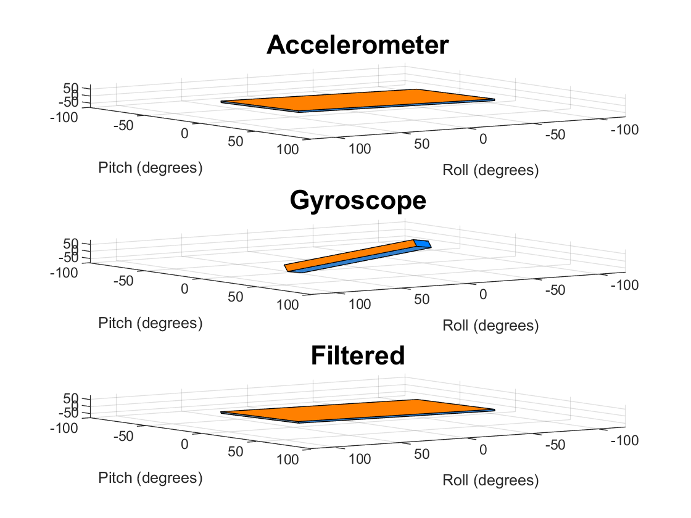
</p>

### Running pyboard with micropython

Downloaded Putty and have acces to sthe SD cards also can interact with the python kernell of the board.

<p align="center">
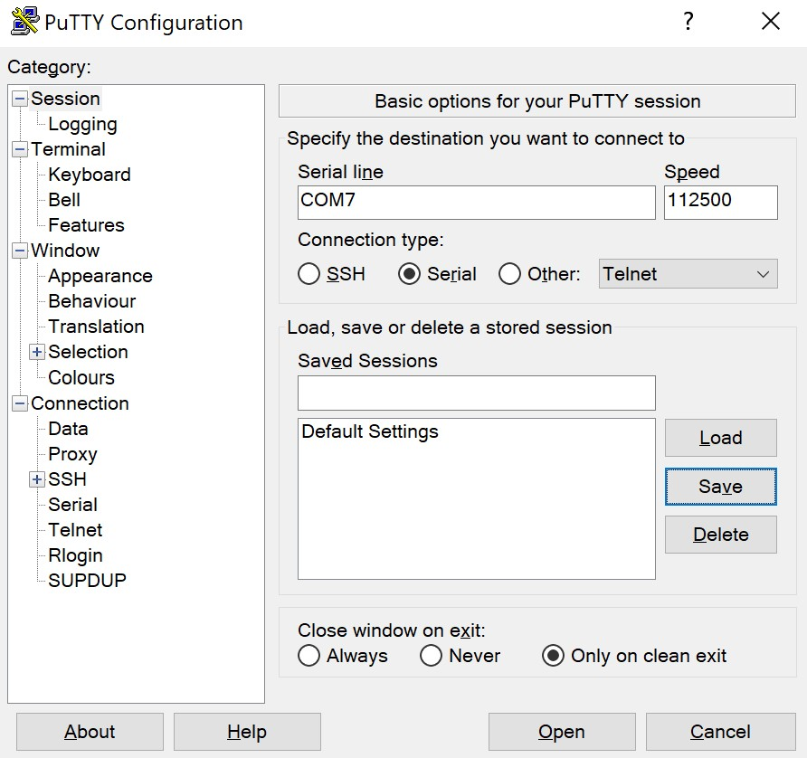
</p>

<p align="center">
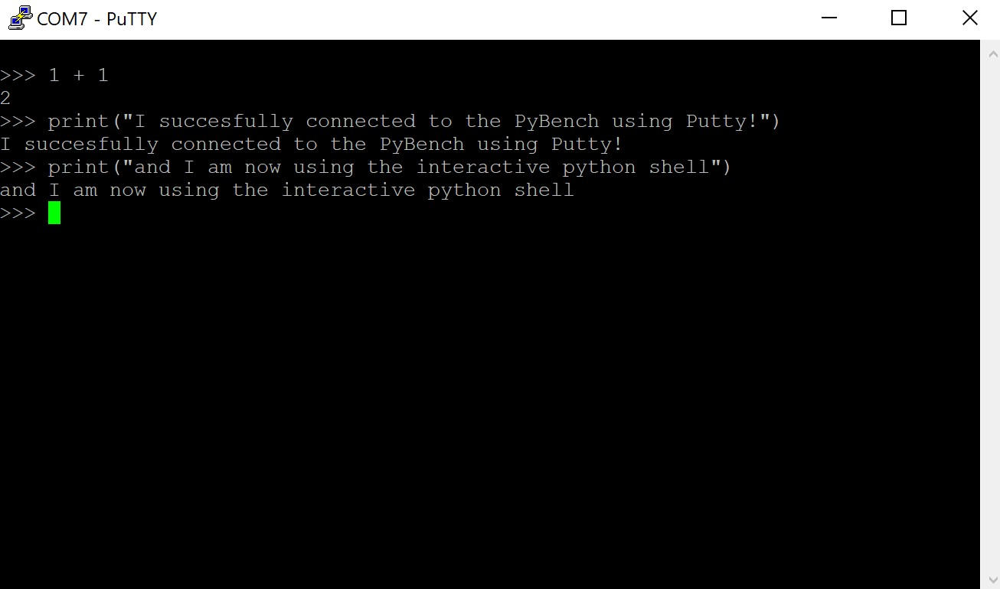
</p>

Then I created the lab4task4 python file with this code:

```python
import pyb
from pyb import LED, ADC, Pin
from oled_938 import OLED_938

b_LED = LED(4)
pot = ADC(Pin("X11"))


i2c = pyb.I2C(2,pyb.I2C.MASTER)
devid = i2c.scan()
oled = OLED_938(
    pinout = {"sda":"Y10","scl":"Y9","res":"Y8"},
    height = 64,
    external_vcc = False,
    i2c_devid=i2c.scan()[0],
)
oled.poweron()
oled.init_display()

oled.draw_text(0,0,"Hello world!")
tic = pyb.millis()

while True:
    b_LED.toggle()
    toc = pyb.millis()
    oled.draw_text(0,20,"Delay time:{:6.3f}sec".format((toc-tic)*0.001))
    oled.draw_text(0,40, "POTSK reading{:5d}".format(pot.read()))
    tic = pyb.millis()
    oled.display()
    delay = py.rng()%1000
    pyb.delay(delay)
```
Loaded it to the SD card and changed the user.py execfile function and run the board which worked nicely :).

<p align="center">
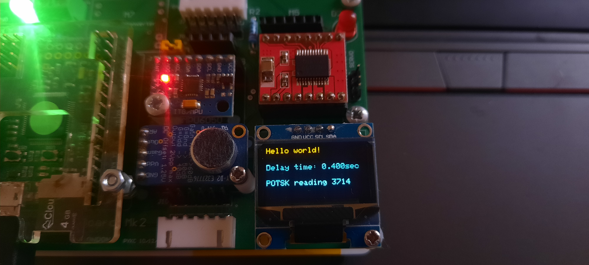
</p>

Then it is just a matter of offseting the text to the right by an amount. The middle is the 64th pixel given its width of 128. There are 12 characters with a width of 7 each but they are pushed to the left so we need to add one more pixel to compensate. 128/2 - 84/2 + 1 = 23.

<p align="center">
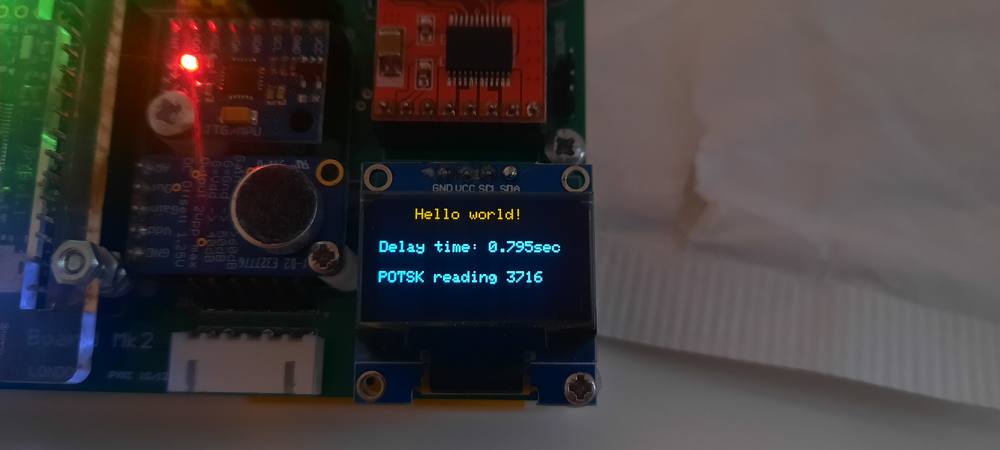
</p>

It is not perfect what makes me think the display isnt 128 pixels wide.
## Pendulum challenge

We managed to do the pendulum challenge with the following code interpolating the values from 0 to 4095 to -90 and 90 and then just plot them from the middle pixel it wasnt too tragic I found online a remapping function and implemented it:

```python
import pyb
from pyb import LED, ADC, Pin
from oled_938 import OLED_938

b_LED = LED(4)
pot = ADC(Pin("X11"))


i2c = pyb.I2C(2,pyb.I2C.MASTER)
devid = i2c.scan()
oled = OLED_938(
    pinout = {"sda":"Y10","scl":"Y9","res":"Y8"},
    height = 64,
    external_vcc = False,
    i2c_devid=i2c.scan()[0],
)
oled.poweron()
oled.init_display()

oled.draw_text(23,0,"Hello world!")

def translate(value, leftMin, leftMax, rightMin, rightMax):
    # Figure out how 'wide' each range is
    leftSpan = leftMax - leftMin
    rightSpan = rightMax - rightMin

    # Convert the left range into a 0-1 range (float)
    valueScaled = float(value - leftMin) / float(leftSpan)

    # Convert the 0-1 range into a value in the right range.
    return rightMin + (valueScaled * rightSpan)

while True:
    b_LED.toggle()
    reading = translate(pot.read(),0,4095,-90,90)
    oled.line(64,0,reading,64,"yellow")
    oled.display()
    pyb.delay(100)
```

Pretty cool but the predefined functions kill the vibe, too simple it doesn't let us dive into the problem properly.

<p align="center">
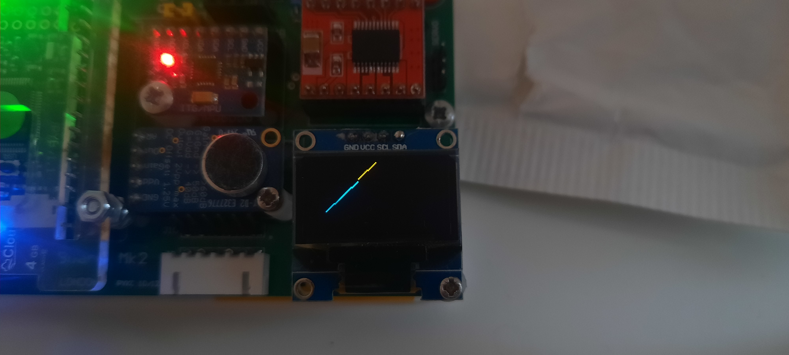
</p>

## Task 5 Using the IMU driver on PyBench Board 

The first task of displaying the readings was pretty nice only things to watch out is the float to string conversion and importing the mpu6050 library.

```python
import pyb
from pyb import LED, ADC, Pin
from oled_938 import OLED_938
from mpu6050 import MPU6050

imu = MPU6050(1,False)
b_LED = LED(4)
pot = ADC(Pin("X11"))


i2c = pyb.I2C(2,pyb.I2C.MASTER)
devid = i2c.scan()
oled = OLED_938(
    pinout = {"sda":"Y10","scl":"Y9","res":"Y8"},
    height = 64,
    external_vcc = False,
    i2c_devid=i2c.scan()[0],
)
oled.poweron()
oled.init_display()

oled.draw_text(22,0,"Pitch rate and angle")
while True:
    b_LED.toggle()
    oled.draw_text(0,20,"Pitch angle: " + str(imu.pitch()))
    oled.draw_text(0,40,"Pitch rate: " + str(imu.get_gy()))
    oled.display()
    pyb.delay(100)
    oled.clear()
```

<p align="center">
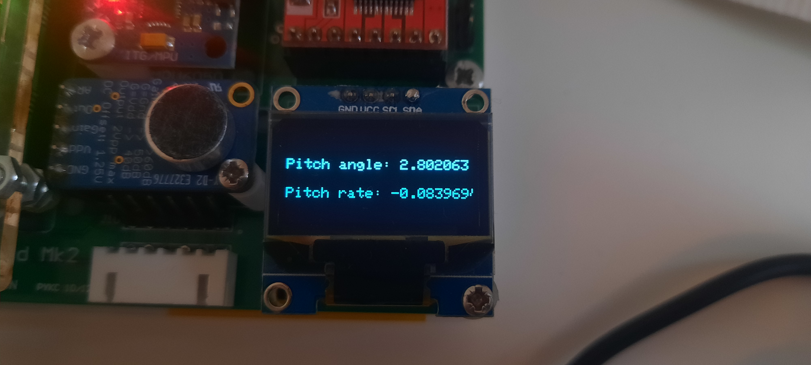
</p>

The second implementation:

```python
import pyb
from pyb import LED, ADC, Pin
from oled_938 import OLED_938
from mpu6050 import MPU6050

imu = MPU6050(1,False)
b_LED = LED(4)
pot = ADC(Pin("X11"))


i2c = pyb.I2C(2,pyb.I2C.MASTER)
devid = i2c.scan()
oled = OLED_938(
    pinout = {"sda":"Y10","scl":"Y9","res":"Y8"},
    height = 64,
    external_vcc = False,
    i2c_devid=i2c.scan()[0],
)
oled.poweron()
oled.init_display()
tic = pyb.millis()
while True:
    a = int(imu.get_acc()[1]*180/3.14)
    toc = pyb.millis()
    g = int((imu.get_gyro()[1] * ((toc-tic)/1000))*180/3.14)
    oled.draw_line(32,32,a,1,1)
    oled.draw_line(86,32,g,1,1)
    oled.display()
    tic = pyb.millis()
    pyb.delay(40)
    oled.clear()
```

This one was a bit weirder because the pendulums seem to be upside down for some reason, and my implementation doesnt work very well to be honest, specially the gyroscope one. It is extremely laggy. After looking back at it I realised I wasnt converting to seconds hence the lag!!! I fixed it the code above is fixed and the gyroscope has the same drifting issue

<p align="center">
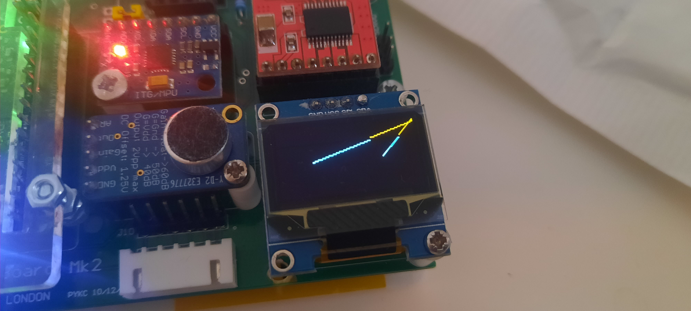
</p>

The final one implementing the filter:

```python
from cmath import pi
import pyb
from pyb import LED, ADC, Pin
from oled_938 import OLED_938
from mpu6050 import MPU6050

imu = MPU6050(1,False)
b_LED = LED(4)
pot = ADC(Pin("X11"))


i2c = pyb.I2C(2,pyb.I2C.MASTER)
devid = i2c.scan()
oled = OLED_938(
    pinout = {"sda":"Y10","scl":"Y9","res":"Y8"},
    height = 64,
    external_vcc = False,
    i2c_devid=i2c.scan()[0],
)
oled.poweron()
oled.init_display()
tic = pyb.millis()
pnew =0
while True:
    a = int(imu.get_acc()[1])
    toc = pyb.millis()
    g = int((imu.get_gyro()[1] * ((toc-tic)/1000)))
    pnew = (0.8*(pnew + g) + (1 - 0.8)*a)
    oled.draw_line(32,32,int(a*180/pi),1,1)
    oled.draw_line(86,32,int(pnew*180/3.14),1,1)
    oled.display()
    tic = pyb.millis()
    pyb.delay(100)
    oled.clear()

```

It kind of works but it looks the same as the one above.