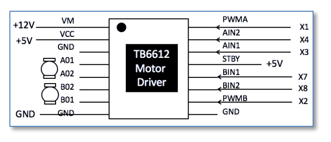
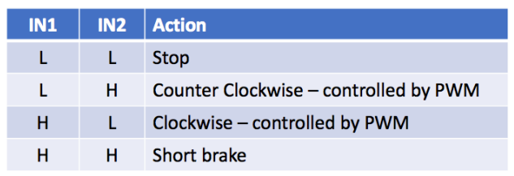
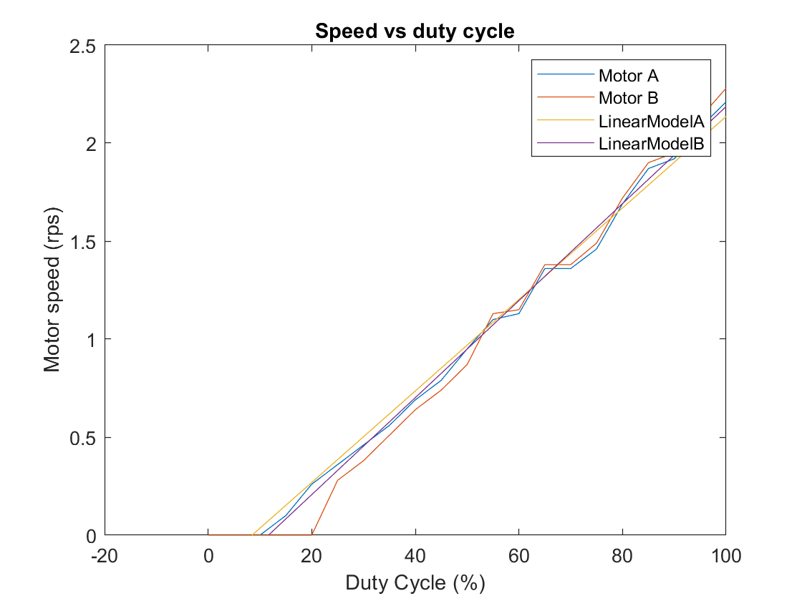
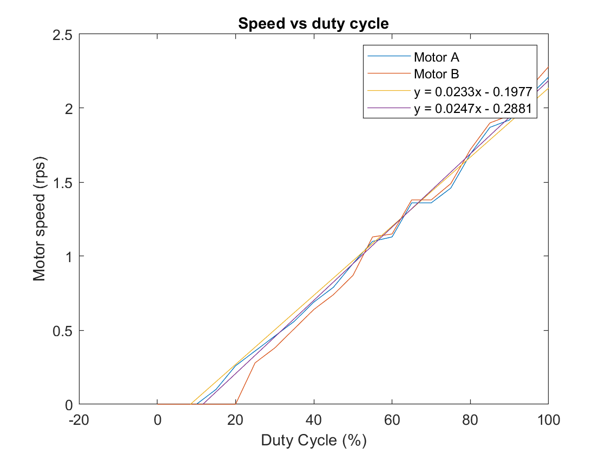

# Electronics 2-Lab 05


This folder contains all the documents regarding the fourth lab of Electronics 2.

This lab is called Motor & Interrupt

## Task 1: DC Motor and H-bridge

The motors are driven using 2 H Bridges within the **TB6612 Motor driver**

 <p align="center">

</p>

And this an input table for the control of the motor:

 <p align="center">

</p>

We used the following code to test the motion of motor A:

```python
import pyb
from pyb import Pin, Timer

A1 = Pin("X3",Pin.OUT_PP)
A2 = Pin("X4",Pin.OUT_PP)
B1 = Pin("X7",Pin.OUT_PP)
B2 = Pin("X8",Pin.OUT_PP)
PwMA = Pin("X1")

tim = Timer(2,freq= 1000)
motorA = tim.channel(1,Timer.PWM, pin = PwMA)
motorB = tim.channel(2,Timer.PWM,pin=PwMA)

def A_forward(value):
    A1.low()
    A2.high()
    motorA.pulse_width_percent(value)

def A_back(value):
    A2.low()
    A1.low()
    motorA.pulse_width_percent(value)

def A_stop():
    A2.low()
    A1.low()

def B_forward(value):
    B1.low()
    B2.high()
    motorB.pulse_width_percent(value)

def B_back(value):
    B2.low()
    B1.low()
    motorB.pulse_width_percent(value)

def B_stop():
    B2.low()
    B1.low()
A_forward(50)
```
A few things to not from this code is the pin definition and how the speed is controlled using PWM, to use PWM you need to enable the timers. Also the way the OUPUT PUll UP is specified in the pin definition. To add control to motor B just create another motor instance and using another channel of Timer 2 to create another PWM although both controlled by the same output pin X1.

Then we added the ability to control the duty cycle using a potentiometer and remaping the values from 0 to 100.

```python
import pyb
from pyb import Pin, Timer

A1 = Pin("X3",Pin.OUT_PP)
A2 = Pin("X4",Pin.OUT_PP)
B1 = Pin("X7",Pin.OUT_PP)
B2 = Pin("X8",Pin.OUT_PP)
PwMA = Pin("X1")

tim = Timer(2,freq= 1000)
motorA = tim.channel(1,Timer.PWM, pin = PwMA)
motorB = tim.channel(2,Timer.PWM,pin=PwMA)
pot = pyb.ADC(Pin("X11"))

def translate(value, leftMin, leftMax, rightMin, rightMax):
    # Figure out how 'wide' each range is
    leftSpan = leftMax - leftMin
    rightSpan = rightMax - rightMin

    # Convert the left range into a 0-1 range (float)
    valueScaled = float(value - leftMin) / float(leftSpan)

    # Convert the 0-1 range into a value in the right range.
    return rightMin + (valueScaled * rightSpan)

def A_forward(value):
    A1.low()
    A2.high()
    motorA.pulse_width_percent(value)

def A_back(value):
    A2.low()
    A1.low()
    motorA.pulse_width_percent(value)

def A_stop():
    A2.low()
    A1.low()

def B_forward(value):
    B1.low()
    B2.high()
    motorB.pulse_width_percent(value)

def B_back(value):
    B2.low()
    B1.low()
    motorB.pulse_width_percent(value)

def B_stop():
    B2.low()
    B1.low()

A_forward(translate(pot.read()),0,4095,0,100)
```
Reading on pin X11 as the example already told us not even the need to go check the datasheet.

Then we just added the OLED library to display it on the display, we had to create a while loop:

```python
import pyb
from pyb import Pin, Timer
from oled_938 import OLED_938

A1 = Pin("X3",Pin.OUT_PP)
A2 = Pin("X4",Pin.OUT_PP)
B1 = Pin("X7",Pin.OUT_PP)
B2 = Pin("X8",Pin.OUT_PP)
PwMA = Pin("X1")

tim = Timer(2,freq= 1000)
motorA = tim.channel(1,Timer.PWM, pin = PwMA)
motorB = tim.channel(2,Timer.PWM,pin=PwMA)
pot = pyb.ADC(Pin("X11"))

i2c = pyb.I2C(2,pyb.I2C.MASTER)
devid = i2c.scan()
oled = OLED_938(
    pinout = {"sda":"Y10","scl":"Y9","res":"Y8"},
    height = 64,
    external_vcc = False,
    i2c_devid=i2c.scan()[0],
)

oled.poweron()
oled.init_display()

def translate(value, leftMin, leftMax, rightMin, rightMax):
    # Figure out how 'wide' each range is
    leftSpan = leftMax - leftMin
    rightSpan = rightMax - rightMin

    # Convert the left range into a 0-1 range (float)
    valueScaled = float(value - leftMin) / float(leftSpan)

    # Convert the 0-1 range into a value in the right range.
    return rightMin + (valueScaled * rightSpan)

def A_forward(value):
    A1.low()
    A2.high()
    motorA.pulse_width_percent(value)

def A_back(value):
    A2.low()
    A1.low()
    motorA.pulse_width_percent(value)

def A_stop():
    A2.low()
    A1.low()

def B_forward(value):
    B1.low()
    B2.high()
    motorB.pulse_width_percent(value)

def B_back(value):
    B2.low()
    B1.low()
    motorB.pulse_width_percent(value)

def B_stop():
    B2.low()
    B1.low()
while True:
    A_forward(translate(pot.read(),0,4095,0,100))
    B_back(translate(pot.read(),0,4095,0,100))
    oled.draw_text(0,0,"Duty cycle:{2f} %".format(translate(pot.read(),0,4095,0,100)))
    pyb.delay(100)
```

## Task 2 – Detect the speed of the motor

To detect the speed of the motor we need to use the hall sensors at the back of the motors and based on how many detections are in a given time period we can estimate the velocity of the motor, we can also determine the direction the same way it works with a rotary encoder.

This is the code used
```python
from re import A
import pyb
from pyb import Pin, Timer
from oled_938 import OLED_938

A1 = Pin("X3",Pin.OUT_PP)
A2 = Pin("X4",Pin.OUT_PP)
B1 = Pin("X7",Pin.OUT_PP)
B2 = Pin("X8",Pin.OUT_PP)
A_sense = Pin("Y4",Pin.PULL_NONE)
B_sense = Pin("Y6",Pin.PULL_NONE)
PwMA = Pin("X1")

tim = Timer(2,freq= 1000)
motorA = tim.channel(1,Timer.PWM, pin = PwMA)
motorB = tim.channel(2,Timer.PWM,pin=PwMA)
pot = pyb.ADC(Pin("X11"))
A_state = 0
A_speed = 0
A_count = 0
tic = pyb.millis()


i2c = pyb.I2C(2,pyb.I2C.MASTER)
devid = i2c.scan()
oled = OLED_938(
    pinout = {"sda":"Y10","scl":"Y9","res":"Y8"},
    height = 64,
    external_vcc = False,
    i2c_devid=i2c.scan()[0],
)

oled.poweron()
oled.init_display()

def translate(value, leftMin, leftMax, rightMin, rightMax):
    # Figure out how 'wide' each range is
    leftSpan = leftMax - leftMin
    rightSpan = rightMax - rightMin

    # Convert the left range into a 0-1 range (float)
    valueScaled = float(value - leftMin) / float(leftSpan)

    # Convert the 0-1 range into a value in the right range.
    return rightMin + (valueScaled * rightSpan)

def A_forward(value):
    A1.low()
    A2.high()
    motorA.pulse_width_percent(value)

def A_back(value):
    A2.low()
    A1.low()
    motorA.pulse_width_percent(value)

def A_stop():
    A2.low()
    A1.low()

def B_forward(value):
    B1.low()
    B2.high()
    motorB.pulse_width_percent(value)

def B_back(value):
    B2.low()
    B1.low()
    motorB.pulse_width_percent(value)

def B_stop():
    B2.low()
    B1.low()
while True:
    if(A_state == 0) and (A_sense.value() == 1):
        A_count += 1
    A_state = A_sense.value()
    toc = pyb.millis()
    if ((toc-tic) >= 100):
        A_speed = A_count
        A_forward(translate(pot.value(),0,4095,0,100))
        A_count = 0

        oled.draw_text(0,20,"Motor A:{:5.2f} rps".format(A_speed/39))
        oled.display()
        tic.pyb.millis()
```

We are polling using the millis functions to capture intervals and of 100 ms and counting the pulses. Nothing too crazy

## Task 3 – Speed measurement using interrupt 

Interrupts are different from polling and they stop the CPU and carry out omething, they are called ISR. Nothing we havent done in the past, for this application is relevant but interrupts are not the answer to everything.

```python
import pyb
from pyb import Pin, Timer, ADC
from oled_938 import OLED_938	# Use OLED display driver

# Define pins to control motor
A1 = Pin('X3', Pin.OUT_PP)		# Control direction of motor A
A2 = Pin('X4', Pin.OUT_PP)
PWMA = Pin('X1')				# Control speed of motor A
B1 = Pin('X7', Pin.OUT_PP)		# Control direction of motor B
B2 = Pin('X8', Pin.OUT_PP)
PWMB = Pin('X2')				# Control speed of motor B

# Configure timer 2 to produce 1KHz clock for PWM control
tim = Timer(2, freq = 1000)
motorA = tim.channel (1, Timer.PWM, pin = PWMA)

# Define 5k Potentiometer
pot = pyb.ADC(Pin('X11'))

# I2C connected to Y9, Y10 (I2C bus 2) and Y11 is reset low active
i2c = pyb.I2C(2, pyb.I2C.MASTER)
devid = i2c.scan()				# find the I2C device number
oled = OLED_938(
    pinout={"sda": "Y10", "scl": "Y9", "res": "Y8"},
    height=64, external_vcc=False, i2c_devid=i2c.scan()[0],
)
oled.poweron()
oled.init_display()
oled.draw_text(0,0, 'Lab 5 - Task 3a')
oled.display()

def isr_motorA(self, line):
	countA += 1
			
def isr_speed_timer(self,t):
	speedA = self.countA
	countA = 0

def A_forward(value):
	A1.low()
	A2.high()
	motorA.pulse_width_percent(value)

def A_back(value):
	A2.low()
	A1.high()
	motorA.pulse_width_percent(value)
	
def A_stop():
	A1.high()
	A2.high()
		
# Initialise variables
speed = 0
A_speed = 0
A_count = 0

#-------  Section to set up Interrupts ----------
def isr_motorA(dummy):	# motor sensor ISR - just count transitions
	global A_count
	A_count += 1
		
def isr_speed_timer(dummy): 	# timer interrupt at 100msec intervals
	global A_count
	global A_speed
	A_speed = A_count			# remember count value
	A_count = 0					# reset the count
	
# Create external interrupts for motorA Hall Effect Senor
import micropython
micropython.alloc_emergency_exception_buf(100)
from pyb import ExtInt

motorA_int = ExtInt ('Y4', ExtInt.IRQ_RISING, Pin.PULL_NONE,isr_motorA)

# Create timer interrupts at 100 msec intervals
speed_timer = pyb.Timer(4, freq=10)
speed_timer.callback(isr_speed_timer)

#-------  END of Interrupt Section  ----------

while True:				# loop forever until CTRL-C
	
	# drive motor - controlled by potentiometer
	speed = int((pot.read()-2048)*200/4096)
	if (speed >= 0):		# forward
		A_forward(speed)

	else:
		A_back(abs(speed))

	# Display new speed
	oled.draw_text(0,20,'Motor Drive:{:5d}%'.format(speed))
	oled.draw_text(0,35,'Motor A:{:5.2f} rps'.format(A_speed/39))	
	oled.display()
	
	pyb.delay(100)

```

And then task b
```python
import pyb
from pyb import Pin, Timer, ADC
from oled_938 import OLED_938	# Use OLED display driver

# Define pins to control motor
A1 = Pin('X3', Pin.OUT_PP)		# Control direction of motor A
A2 = Pin('X4', Pin.OUT_PP)
PWMA = Pin('X1')				# Control speed of motor A
B1 = Pin('X7', Pin.OUT_PP)		# Control direction of motor B
B2 = Pin('X8', Pin.OUT_PP)
PWMB = Pin('X2')				# Control speed of motor B

# Configure timer 2 to produce 1KHz clock for PWM control
tim = Timer(2, freq = 1000)
motorA = tim.channel (1, Timer.PWM, pin = PWMA)
motorB = tim.channel (2, Timer.PWM, pin = PWMB)

# Define 5k Potentiometer
pot = pyb.ADC(Pin('X11'))

# I2C connected to Y9, Y10 (I2C bus 2) and Y11 is reset low active
i2c = pyb.I2C(2, pyb.I2C.MASTER)
devid = i2c.scan()				# find the I2C device number
oled = OLED_938(
    pinout={"sda": "Y10", "scl": "Y9", "res": "Y8"},
    height=64, external_vcc=False, i2c_devid=i2c.scan()[0],
)
oled.poweron()
oled.init_display()
oled.draw_text(0,0, 'Lab 5 - Task 3b')
oled.display()

def isr_motorA(self, line):
	countA += 1
			
def isr_motorB(self, line):
	countB += 1

def isr_speed_timer(self,t):
	speedA = self.countA
	speedB = self.countB
	countA = 0
	countB = 0

def A_forward(value):
	A1.low()
	A2.high()
	motorA.pulse_width_percent(value)

def A_back(value):
	A2.low()
	A1.high()
	motorA.pulse_width_percent(value)
	
def A_stop():
	A1.high()
	A2.high()
	
def B_forward(value):
	B2.low()
	B1.high()
	motorB.pulse_width_percent(value)

def B_back(value):
	B1.low()
	B2.high()
	motorB.pulse_width_percent(value)
	
def B_stop():
	B1.high()
	B2.high()
	
# Initialise variables
speed = 0
A_speed = 0
A_count = 0
B_speed = 0
B_count = 0

#-------  Section to set up Interrupts ----------
def isr_motorA(dummy):	# motor A sensor ISR - just count transitions
	global A_count
	A_count += 1

def isr_motorB(dummy):	# motor B sensor ISR - just count transitions
	global B_count
	B_count += 1
		
def isr_speed_timer(dummy): 	# timer interrupt at 100msec intervals
	global A_count
	global A_speed
	global B_count
	global B_speed
	A_speed = A_count			# remember count value
	B_speed = B_count
	A_count = 0					# reset the count
	B_count = 0
	
# Create external interrupts for motorA Hall Effect Senor
import micropython
micropython.alloc_emergency_exception_buf(100)
from pyb import ExtInt

motorA_int = ExtInt ('Y4', ExtInt.IRQ_RISING, Pin.PULL_NONE,isr_motorA)
motorB_int = ExtInt ('Y6', ExtInt.IRQ_RISING, Pin.PULL_NONE,isr_motorB)

# Create timer interrupts at 100 msec intervals
speed_timer = pyb.Timer(4, freq=10)
speed_timer.callback(isr_speed_timer)

#-------  END of Interrupt Section  ----------

while True:				# loop forever until CTRL-C
	
	# drive motor - controlled by potentiometer
	speed = int((pot.read()-2048)*200/4096)
	if (speed >= 0):		# forward
		A_forward(speed)
		B_forward(speed)
	else:
		A_back(abs(speed))
		B_back(abs(speed))

	# Display new speed
	oled.draw_text(0,20,'Motor Drive:{:5d}%'.format(speed))
	oled.draw_text(0,35,'Motor A:{:5.2f} rps'.format(A_speed/39))	
	oled.draw_text(0,45,'Motor B:{:5.2f} rps'.format(B_speed/39))	
	oled.display()
	
	pyb.delay(100)

```

And then we plotted the pwm duty cycle against the motor speed, they are fairly linear for a certain region and they are not identical.

 <p align="center">

</p>
 <p align="center">

</p>
I fit the data through a linear model so we could have workout an aproximate duty cycle for a given speed