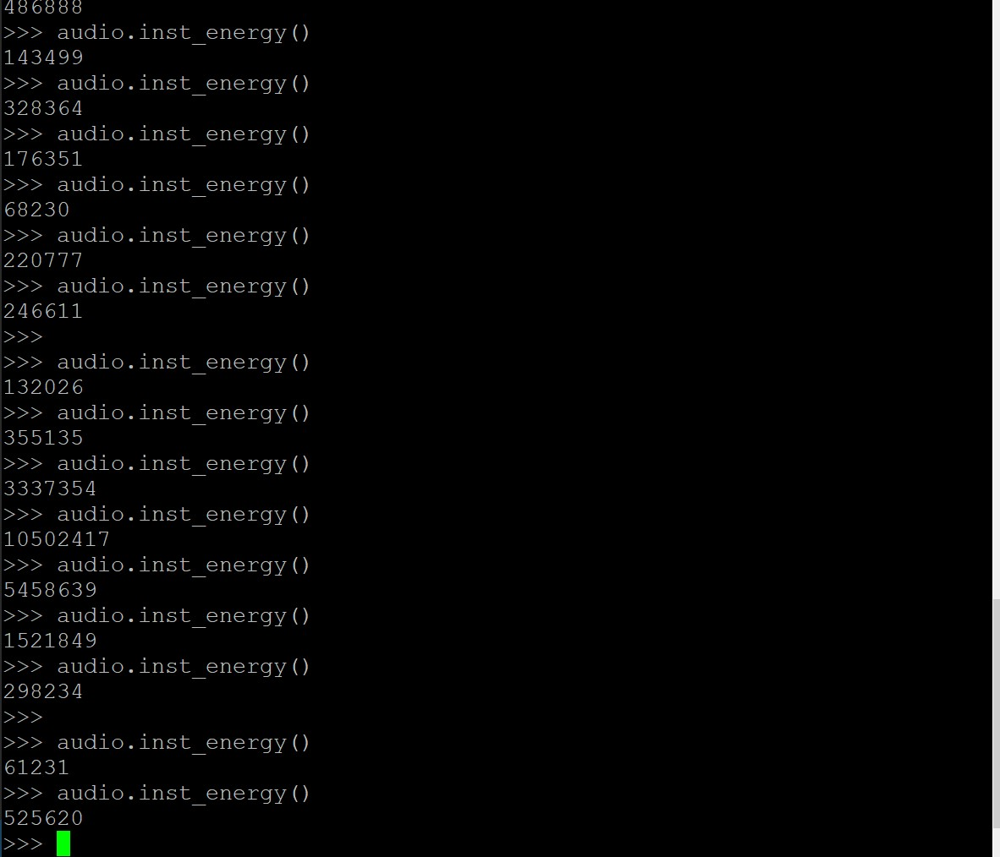

# Electronics 2-Lab 06


This folder contains all the documents regarding the sixth lab of Electronics 2.

This lab is called Beat Detection.

## Task 1: Moving Average filter

We used the 3 tap script given by the lab documentation and then I made my own script which I was very happy because it looked exactly like the one in the solutions:

```matlab
clear all
[sig fs] = audioread('bgs.wav');

x = sig + 0.2*rand(size(sig));
figure(1)
clf;
xlabel('Sample N')
ylabel('Signal (V)')
title('Stay Alive Musicote')

N = size(x);
taps = 1000;
for i=taps:N
    y(i)=0;
    for j = 0:taps-1
        y(i) = y(i) + x(i -j);
    end
    y(i) = y(i)/taps;
end
plot(x)
hold on
plot(y)
sound(x,fs)
disp('Original')
pause
sound(y,fs)
disp('Filtered')
```

We also decided to plot both signals to look at the filtered and unfiltered output.

10 taps
<p align="center">

</p>

20 taps
<p align="center">

</p>
50 taps
<p align="center">

</p>
1000 taps
<p align="center">

</p>

I think the best description of the filter effect on the audio is "de-crisping" the sound. Underwater and it makes sense because it is what we are doing right, getting a lot of samples and averaging them.

## Task 2: Exploring MICROPHONE Class

The code is pretty self explanatory and we tested it:

```python
from audio import MICROPHONE
import pyb
from pyb import ADC, Pin, Timer

mic = ADC(Pin('Y11'))
sample_timer = Timer(7, freq=8000)

audio = MICROPHONE(sample_timer,mic,160)
```
audio.data()
<p align="center">

</p>

audio.instenergy()
<p align="center">

</p>

## Task 3: Basic Beat Detection

We played with the code for a bit and instead tunning the code we tuned the song, the perfect match is a song which has a bpm close to the min time period.
```python
import random
import pyb
from pyb import Pin, Timer, ADC, DAC, LED
from array import array			# need this for memory allocation to buffers
from oled_938 import OLED_938	# Use OLED display driver
from audio import MICROPHONE
from neopixel import NeoPixel
import pyb
from pyb import Pin

#  The following two lines are needed by micropython
#   ... must include if you use interrupt in your program
import micropython
micropython.alloc_emergency_exception_buf(100)

# I2C connected to Y9, Y10 (I2C bus 2) and Y11 is reset low active
i2c = pyb.I2C(2, pyb.I2C.MASTER)
devid = i2c.scan()				# find the I2C device number
oled = OLED_938(
    pinout={"sda": "Y10", "scl": "Y9", "res": "Y8"},
    height=64,
    external_vcc=False,
    i2c_devid=i2c.scan()[0],
)
oled.poweron()
oled.init_display()
oled.draw_text(0,0, 'Beat Detection')
oled.display()

# define ports for microphone, LEDs and trigger out (X5)

b_LED = LED(4)		# flash for beats on blue LED
np = NeoPixel(Pin("Y12", Pin.OUT),8)

def flash():		# routine to flash blue LED when beat detected
	b_LED.on()
	pyb.delay(10)
	b_LED.off()

# Create timer interrupt - one every 1/8000 sec or 125 usec
pyb.disable_irq()
sample_timer = pyb.Timer(7, freq=8000)	# set timer 7 for 8kHz
N = 160				# number of sample to calculate instant energy
mic = ADC(Pin('Y11'))
audio = MICROPHONE(sample_timer, mic, N)
pyb.enable_irq(True)
oled.draw_text(0,20, 'Ready to GO')	# Useful to show what's happening?
oled.display()
pyb.delay(100)
up = 1
# Calculate energy over 50 epochs, each 20ms (i.e. 1 sec)
M = 50						# number of instantaneous energy epochs to sum
BEAT_THRESHOLD = 2.0		# threshold for c to indicate a beat
MIN_BEAT_PERIOD = 500	# no beat less than this

# initialise variables for main program loop
e_ptr = 0					# pointer to energy buffer
e_buf = array('L', 0 for i in range(M))	# reserve storage for energy buffer
sum_energy = 0				# total energy in last 50 epochs

tic = pyb.millis()			# mark time now in msec

while True:				# Main program loop
	if audio.buffer_is_filled():		# semaphore signal from ISR - set if buffer is full
		
		# Fetch instantaneous energy
		E = audio.inst_energy()			# fetch instantenous energy
		audio.reset_buffer()			# get ready for next epoch

		# compute moving sum of last 50 energy epochs with circular buffer
		sum_energy = sum_energy - e_buf[e_ptr] + E
		e_buf[e_ptr] = E			# over-write earliest energy with most recent
		e_ptr = (e_ptr + 1) % M		# increment e_ptr with wraparound - 0 to M-1
		average_energy = sum_energy/M

		# Compute ratio of instantaneous energy/average energy
		c = E/average_energy
		list1 = [1,2,3,4,5]
		jeje = random.choice(list1)
		jeja = random.choice(list1)
		jiji = random.choice(list1)
		if (pyb.millis()-tic > MIN_BEAT_PERIOD):	# if longer than minimum period
			if (c>BEAT_THRESHOLD):
				if (up == 0):		# look for a beat
					for i in range(8):
						np[7-i] = (51*jeja,51*jeje,51*jiji)
						np.write()
						pyb.delay(15)
					for i in range(8):
						np[i] = (0,0,0)
						np.write()
						pyb.delay(1)					# beat found, flash blue LED
					tic = pyb.millis()
					up = 1
				else:		# look for a beat
					for i in range(8):
						np[i] = (51*jeja,51*jeje,51*jiji)
						np.write()
						pyb.delay(15)
					for i in range(8):
						np[i] = (0,0,0)
						np.write()
						pyb.delay(1)					# beat found, flash blue LED
					tic = pyb.millis()
					up = 0
						# reset tic
		audio.reset_buffer()				# reset status flag
```
It worked pretty nice, I have to say I prefer matlab because it is easier to plot stuff, this code also has the stuff from part 4
## Task 4: Dancing Light Show

We modified the code using the examples we went for a pseudo random number generator which altered the rgb values and first they would light sequentially up and then down, a video would be better if you would like to see please ask me.