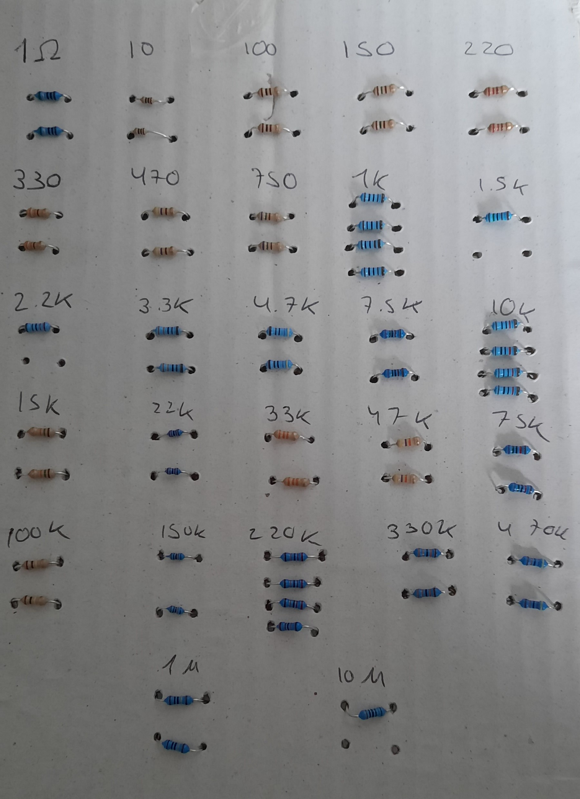
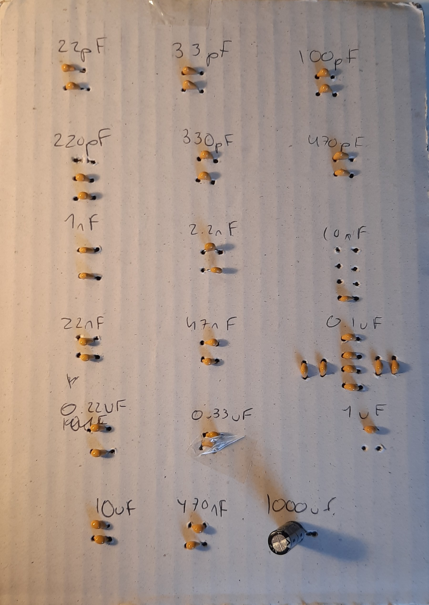

# Electronics 1-Lab 0

This folder contains all the documents regarding the zeroth lab.

This lab is called Signals and Scope and it consists on Setting up the Lab-in-a-Box and the Signal Generator.

## Creating component storage

I found this step very tedious and long but I hope it will be worth it in the long run. I took a slightly different approach, I wasn't a huge fan of using the tape (although I ended up using some because some components were a bit loose). I used a thick carboard piece and punctured holes and I passed the legs of the resistors and the capacitors through them. I labelled them accordingly and stuck them to my wall.

 Here are some images

| The resistor carboad | The capacitor cardboard |

| --- | --- |

|||
## Prepare wire stripper

## Prepare Signal Generator
### Step 1
### Step 2
### Step 3
### Step 4
### Step 5
### Step 6
### Step 7
### Step 8
### Step 9
### Step 10